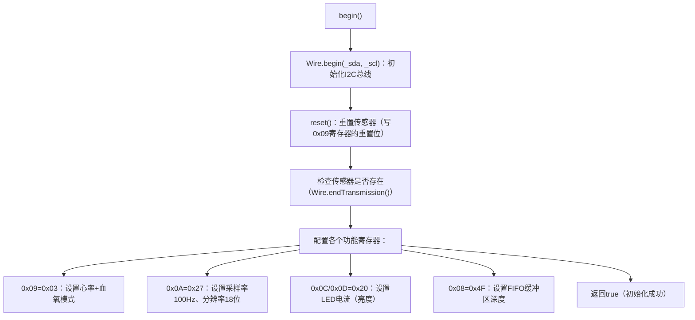
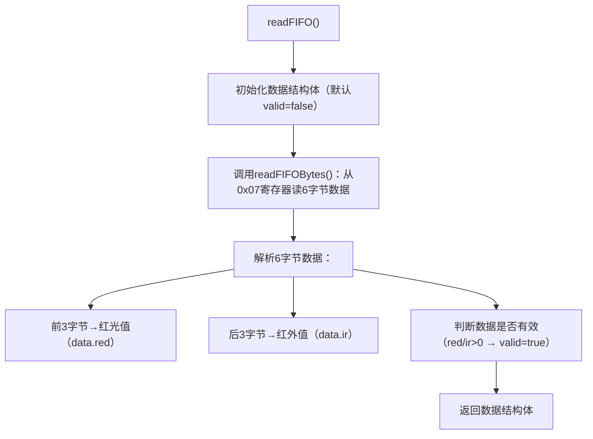

# ESP32开发教程

# 1、介绍

## 1、什么是ESP32


## 2、常见型号


# 2、开发环境的搭建

## 1、安装软件

1、需要vm、Ubuntu、git、vscode、mobaXterm

## 2、环境安装

1、Ubuntu安装net-tools网络工具

```
sudo apt install net-tools
```


安装之后，可以使用命令查看ip地址

```
ifconfig # 查看网络配置
```

2、使用mobaxterm连接Ubuntu


输入虚拟机的ip地址，后点击确定，之后在命令行中根据提示输入用户名或密码

**3、安装必要工具**

```
 1、安装必要工具
sudo apt-get install git wget flex bison gperf python3-pip python3-venv cmake ninja-build ccache libffi-dev libssl-dev dfu-util libusb-1.0-0 net-tools

# 2、拉取esp工具
git clone https://gitee.com/Espressifsystems/esp-gitee-tools.git

# 进入克隆的辅助工具
cd esp-gitee-tools

# 执行替换镜像的脚本
./jihu-mirror.sh set

# 回到上级目录
cd ..


# 3、拉取esp-idf
git clone --recursive https://github.com/espressif/esp-idf.git
```

**4、vscode连接虚拟机**

安装插件remote-ssh


安装后如图选中对应的配置文件


在配置文件中，输入自己安装的虚拟机的IP地址、还有登录的用户名称


保存配置文件后选择在当前窗口连接


之后按提示选择操作系统并输入密码

**5、开发环境的配置**

```
# 进入克隆的esp-idf
cd ./esp-idf

# 切换到5.2版本
git checkout v5.2

# 把子模块也切换到对应版本
git submodule update --init --recursive
```

**6、编译工具安装**

```
# 在idf目录下执行esp-gitee-tools的安装脚本
# 这里注意路径问题，我克隆的esp-gitee-tools就在上级目录
../esp-gitee-tools/install.sh
```

**7、示例程序下载**

```
# 4、拉取示例工程
git clone --recursive https://gitee.com/vi-iot/esp32-board.git
```

**8、设置环境变量**

在esp-idf目录下执行脚本

```
# 配置环境变量的脚本
source export.sh
```

# 2、esp32点亮led灯

## 1、gpio引脚

负责输入、输出电压的引脚，D开头的引脚。每个gpio都可以输出高低电平
高低电平：esp32中，高电平大于2.5v，低电平小于0.5v

## 2、接线原理图


如图，D12输出高电平，串联电阻保护电路

## 3、代码

写在Arduino里的

```
// 定义要使用的引脚
int led_pin = 12;

void setup() {
  // 设定引脚为输出模式
  pinMode(led_pin, OUTPUT); // 将该引脚设置为“输出”模式

}

void loop() {
  // put your main code here, to run repeatedly:
  digitalWrite(led_pin, HIGH); // 向该引脚输出高电平（3.3V）
  delay(1000);
  digitalWrite(led_pin, LOW);
  delay(1000);
}
```

# 3、platformio开发

## 1、介绍

platformio是一个开源开发平台，提供统一开发环境和工具链


## 2、安装与使用

vscode插件查找platformio，并安装


点击左侧蚂蚁图标，再点击open，即可进入主页


选择new project，写入项目名称，选择开发板型号，选择框架，选择存放路径。然后点击finish。等待安装依赖工具链和开发框架


完成后如图 


文件列表如图


.pio是工作目录，包含生成的二进制文件和日志文件

.vscode，包含vscode的配置文件

include，存放头文件

lib，存放依赖库文件

scr存放源代码

test存放测试代码

.gitgnode，版本调试工具，在文件中忽略上传的文件

platformio.ini，项目配置文件

在主页中，可以方便的安装库


# 4、串口通信

串口是所有单片机都有的外设，实现通信与程序下载功能


异步串行通信


异步通信的工作流程，很像一位一字地写信和读信：

1. **准备发送**：发送方（如单片机）把要发送的数据（比如一个字节，8位）装入一个特殊的发送寄存器。

2. **打包**：硬件会自动为这个数据“打包”，在它前面加上一个**起始位**（低电平），在后面加上**停止位**（高电平），组成一个完整的“数据帧”。

3. **寄出信件**：发送方按照约定好的**波特率**，将这个数据帧的二进制位（0或1）一位一位地通过TX线发送出去。

4. **检测与同步**：接收方一直在监听RX线。当检测到线路从空闲的高电平变为低电平时，就知道**起始位**来了。它会立刻启动内部计时，并按照相同的波特率开始接收后续的数据位。

5. **拆包读取**：接收方将接收到的数据位组合起来，去掉起始位和停止位，就得到了原始数据，并将其存入接收寄存器，等待程序读取。

整个过程，双方依靠起始位作为同步信号，并依赖各自独立的、但速率一致的时钟来完成一位位数据的准确识别。


一般使用UART2和外部串口设备通信

---

可以把 **ESP32芯片**想象成一个聪明的“大脑”。这个大脑自带了**三套独立的“嘴巴”（TX）和“耳朵”（RX）**，专业名称就是**三个硬件UART**。

- **UART0**：这是它的“**主嘴巴和主耳朵**”。默认情况下，它用GPIO1当嘴巴（TX）说话，用GPIO3当耳朵（RX）听话。**你最常用它来和电脑通信，进行程序调试和打印信息。**

- **UART1**​ 和 **UART2**：这是它的“**副嘴巴和副耳朵**”。比如，UART2用GPIO17（TX）和GPIO16（RX）。**你可以用它们同时连接其他设备**，比如让UART1连GPS模块获取位置，UART2连蓝牙模块和手机通信。

**为什么需要三个？**

想象一下，如果你只有一个嘴巴（UART0）用来和电脑说话（调试），那当你同时想和GPS、蓝牙模块聊天时，就得不停“插嘴”，非常麻烦且容易混乱。有了三个UART，就可以**同时、独立地**处理三路对话，互不干扰。

---

| UART 通道    | 默认的“嘴巴”           | 默认的“耳朵”           | 主要用途                         |
| ---------- | ----------------- | ----------------- | ---------------------------- |
| **UART0**​ | **GPIO 1**​ (TX)  | **GPIO 3**​ (RX)  | **调试/编程**（连接电脑USB转串口）        |
| **UART1**​ | GPIO 10 (TX)      | GPIO 9 (RX)       | 连接外部设备（注意：GPIO9, 10有时用于内部闪存） |
| **UART2**​ | **GPIO 17**​ (TX) | **GPIO 16**​ (RX) | **连接外部设备（最常用、最安全）**​         |

- **和电脑通信（下载程序、看调试信息）**：默认就使用 **UART0**。

- **和自己的传感器、模块通信**（比如手环的心跳传感器）：优先选择使用 **UART2**。

#### **2. 开发板图**

理论表告诉了你用**GPIO 17**当嘴巴，**GPIO 16**当耳朵。但它们在板子上哪个位置？

1. **在右侧的板子示意图上**，找到标有 GPIO16​ 和 GPIO17的引脚。它们通常分布在板子两侧。

2. **拿出你真实的ESP32开发板**，对照图片，找到这两个**物理引脚**。

3. **连接**：将你的外部模块（如传感器）的**TX线**，接到ESP32的**GPIO16（RX，耳朵）**；将模块的**RX线**，接到ESP32的**GPIO17（TX，嘴巴）**。

4. 记住：**TX 接 RX，RX 接 TX**，就像打电话要听筒对麦克风一样。Tx发送数据，Rx接收数据

---


---

## 第一部分：理解这张图在“做什么事”

**一句话总结：这张图在教你怎么让ESP32和电脑“说上话”。**

- **为什么需要这个**？​ ESP32开发板自己不会在屏幕上显示信息。需要让它把程序运行结果、传感器数据告诉电，这样才能看到、调试、记录。同时，你也需要从电脑**发送指令**给它。

- **为什么需要“串口模块”**？​ 你的电脑USB口说的是“USB协议语言”，而ESP32的UART引脚（TX/RX）说的是“串口协议语言”。它们语言不通，**串口模块就是一个“翻译官”**，负责在两者之间转换。

- **最终目标**：实现 **“电脑 ↔ 串口模块 ↔ ESP32”​** 三者之间的双向对话。

---

### 第二部分：逐行解析“物料清单 (BOM表)”

1. **物料清单 (BOM表)**：
   
   - **含义**：BOM = Bill of Materials。这是硬件工程师和电子爱好者在动手前必须列出的清单，确保不缺零件。****

2. **材料名称 | 数量**：
   
   - **串口模块 1个**：
     
     - **最常用的就是 USB转TTL串口模块**（比如基于CH340、CP2102、FT232芯片的）。它一端是**USB接口**（插电脑），另一端会引出**几根排针**，包括关键的：`VCC`(电源正极), `GND`(地线), `TX`, `RX`。
     
     - **它的角色**：核心翻译官 + 临时充电宝。它既翻译语言，也能通过USB从电脑取电，给ESP32开发板供电（通过连接`VCC`和`GND`）。
     
     - **直观比喻**：就像一个自带电源的“USB-对讲机适配器”。
- **杜邦线(跳线) 若干**：
  
  - 这是什么？​ 一头是插针（公头），一头是孔（母头）的彩色小导线。**它是电子世界的“万能接线器”**，用来在开发板、模块、面包板之间临时、灵活地连接电路。
  
  - 需要多少？**​ “若干”意味着至少需要**4根（用于连接`VCC`, `GND`, `TX`, `RX`），但最好准备一整套（多种颜色），方便用颜色区分信号（如红色接电源，黑色接地，绿色黄色接数据）。

---

### 第三部分：核心连线指令详解

**ESP32的RX2引脚连串口模块的TX，TX2连RX**

这句话是所有嵌入式通信连线的黄金法则

1. **引脚名解析**：
   
   - **RX2**：这是**ESP32上UART2的接收引脚**。
   
   - **TX2**：这是**ESP32上UART2的发送引脚**。
   
   - **串口模块的TX**：这是**串口模块的“嘴”**，它负责向外部设备“说” 从电脑发来的话。
   
   - **串口模块的RX**：这是**串口模块的“耳”**，负责**听外部设备说的话**，并传回电脑。

2. **为什么这样交叉连接？**
   
   **逻辑是：一个设备的“嘴”（TX）必须对着另一个设备的“耳”（RX），这样信息才能被听到。**
   
   - **情景A（电脑发指令给ESP32）**：
     
     电脑说 → 串口模块听到(USB) → 串口模块用它的 **“嘴巴”(TX)​ 说出来** → 必须让ESP32的“耳朵”(RX2)听到。
     
     **所以：串口模块的`TX`→ 连接 → ESP32的`RX2`(`GPIO16`)。**
   
   - **情景B（ESP32发数据给电脑）**：
     
     ESP32用它的“嘴巴”(TX2) 说 → 必须让串口模块的 “耳朵”(RX) 听到 → 串口模块转述给电脑(USB)。
     
     **所以：ESP32的`TX2→ 连接 → 串口模块的`RX`。**
   
   **一句话口诀：`TX`找 `RX`， `RX`找 `TX`。要交叉，不能直连。**

3. **电力供应（图中隐含但必须做的）**：
   
   除了传递信息，还得给ESP32供电才能工作。
   
   - 串口模块的`VCC`**​ → 接 ESP32的`VCC`或`5V/3V3`**（具体看模块输出和ESP32输入电压，通常接`3V3`更安全）。
   
   - 串口模块的`GND`**​ → 接 ESP32的`GND`**。
     
     重要：`GND`提供了电压参考的“零电位”，是所有信号正确识别的共同基础。

4、 **串口模块**：通过USB线直接插入电脑USB口。

- **ESP32**：通过上面的4根杜邦线，**经串口模块间接连接到了电脑**。

- 此时，在电脑上打开一个“串口调试助手”软件，选择正确的串口号（COM口，电脑为串口模块分配的），设置好波特率（如115200），你就能在软件里**接收ESP32发送的数据**，也能**向ESP32发送指令**了。

---

## 串口通信基本概念总结

    esp32上，有三个UART模块，用来接收和发送数据，由于是异步传输模块，需要两个不同的引脚担任传输与发送任务。

    由此，每个模块下，有对应的引脚实现收发数据的功能。
    关于串口模块，串口模块可以与电脑USB通信，我们可以用ESP32与串口模块进行串口通信，串口模块通过USB协议把串口数据传输给电脑。

## 2、代码

**hardwareSerial库常用函数**


```
void setup() {
   // 初始化串口通信波特率
  Serial.begin(9600);
  Serial2.begin(9600);
}

void loop() {
  // 监测serial0是否有数据接受到，有就读取一个字节，然后发送给serial2

  // 从串口监视器读取输入数据
  // 如果有数据
  if(Serial.available()){
    char data = Serial.read();

    // 把数据发送给UART2
    Serial2.write(data);
  }

  // 从UART2读取输入数据
  if(Serial2.available()){
    char data = Serial2.read();

    // 把数据发送给UART0
    Serial.write(data);
  }
}
```


# 5、WiFi模块

主要目的：让esp32连接WiFi后，打印信息在串口调试


esp32的WiFi可以产生热点，手机与电脑可以连接这个热点

SAT模式则是让电脑与设备连接到同一个网段的路由器上

## 函数


## 代码

```
#include <Arduino.h>
#include <WiFi.h>

const char* ssid = "要连接的WiFi名";
const char* password = "WiFi密码";

void create_AP();
void connect_Wifi();

void setup() {
  // create_AP();
  connect_Wifi();
}

void loop() {

}

/// @brief 创建热点
void create_AP(){
  const char* A_ssid = "ESP32";
  const char* A_password = "ESP32"; 

  WiFi.softAP(A_ssid, A_password); // 创建热点
}

/// @brief 连接WiFi
void connect_Wifi(){
  Serial.begin(9600); // 设置UART0的波特率，开始进行串口监听

  WiFi.begin(ssid, password); // 输入名称与密码连接WiFi

  // 如果WiFi没有连接上，就等待，直到连接成功,再执行下一步
  while (WiFi.status() != WL_CONNECTED)
  {
    delay(500);
    Serial.print("正在连接中......  ");
  }

  Serial.println("");
  Serial.println("WiFi连接成功");
  Serial.print("The ip address is ");
  Serial.println(WiFi.localIP());
}
```

# ESP32获取网络请求

网络请求基本原理


http请求和客户端与服务端的通信方式，用于获取或发送web资源


## 网络请求常用函数


## 解析json数据常用的库


## 代码

```
#include <Arduino.h>
#include <WiFi.h>
#include <HTTPClient.h>
#include <ArduinoJson.h>

// WiFi网络配置
const char* ssid = " ";          // WiFi网络名称
const char* password = "1145141919810"; // WiFi密码

// 服务器配置
String baseURL = "http://192.168.1.7:8080";     // Spring Boot服务器地址
String api = "/api/esp32/hello/hello_world";    // API接口路径

// 函数声明
void create_AP();     // 创建WiFi热点
void connect_Wifi();   // 连接WiFi网络

/**
 * 初始化函数 - 程序启动时执行一次
 * 功能：完成WiFi连接和HTTP请求的初始化工作
 */
void setup() {
  // create_AP(); // 可选：创建热点模式（当前被注释）
  connect_Wifi(); // 连接WiFi网络

  // 创建HTTP客户端对象
  HTTPClient http;

  // 指定要请求的URL地址
  http.begin(baseURL + api);

  // 发送HTTP GET请求并获取状态码
  int httpCode = http.GET();
  Serial.printf("HTTP状态码为: %d", httpCode);

  // 获取服务器返回的响应内容
  String ans = http.getString();
  Serial.println(ans);

  // 关闭HTTP连接释放资源
  http.end();

  // 创建JSON文档对象（预留1024字节内存空间）
  DynamicJsonDocument doc(1024);

  // 解析JSON格式的响应数据
  deserializeJson(doc, ans);
  // 从JSON对象中提取"message"字段的值
  String message = doc["message"].as<String>();
  Serial.println(message);
}

/**
 * 主循环函数 - 在setup()执行后循环执行
 * 当前为空，可用于后续的持续任务处理
 */
void loop() {
  // 此处可添加定时任务、传感器数据采集等循环执行的功能
}

/**
 * 创建WiFi热点（Access Point模式）
 * 功能：将ESP32设置为热点，允许其他设备连接
 */
void create_AP(){
  const char* A_ssid = "ESP32";        // 热点名称
  const char* A_password = "ESP32";   // 热点密码

  // 创建WiFi热点
  WiFi.softAP(A_ssid, A_password);
}

/**
 * 连接WiFi网络（Station模式）
 * 功能：连接到指定的WiFi网络并显示连接状态
 */
void connect_Wifi(){
  // 初始化串口通信，波特率9600
  Serial.begin(9600);

  // 开始连接WiFi网络
  WiFi.begin(ssid, password);

  // 等待WiFi连接成功
  Serial.print("正在连接WiFi");
  while (WiFi.status() != WL_CONNECTED)
  {
    delay(500);
    Serial.print(".");
  }

  // WiFi连接成功提示
  Serial.println("\nWiFi连接成功");
  Serial.print("IP地址: ");
  Serial.println(WiFi.localIP()); // 显示获取到的IP地址
}  Serial.print("The ip address is ");
  Serial.println(WiFi.localIP());
}
```

# MQTT

## 1、基本知识

MQTT（Message Queuing Telemetry Transport），中文叫**消息队列遥测传输协议**，是一种轻量级的、基于发布/订阅模式的物联网通信协议。

- 核心定位：专门为**低带宽、不稳定网络**（比如物联网设备、传感器）设计，占用资源极少（最小数据包仅2字节）；

- 类比理解：像生活中的**小区快递柜**——设备（寄件人）把消息放到指定**柜子（主题）**，**需要的设备**自己去对应柜子取，不用直接对接，中间由**快递柜管理员**（MQTT服务器）协调。
  
  ## 二、MQTT核心概念
  
  | 概念              | 通俗解释                                                             |
  | --------------- | ---------------------------------------------------------------- |
  | 发布者（Publisher）  | 发送消息的一方（比如温湿度传感器、手机APP），只负责发消息到指定主题，不关心谁接收                       |
  | 订阅者（Subscriber） | 接收消息的一方（比如显示屏、服务器、另一个设备），需要先订阅主题才能收到对应消息                         |
  | 主题（Topic）       | 消息的分类标签，是发布/订阅的核心匹配依据，格式类似文件路径（如`sensor/temperature/livingroom`） |
  | 代理服务器（Broker）   | 核心中间件，负责接收发布者的消息、转发给订阅了对应主题的订阅者（相当于“快递柜管理员”）                     |
  | 客户端（Client）     | 所有连接到Broker的设备/程序（发布者、订阅者都是客户端）                                  |
  
  ### 1. 核心通信模式：发布/订阅（Publish/Subscribe）

- 区别于“一对一”的TCP直连：MQTT是“一对多”松耦合通信，发布者和订阅者无需知道对方的存在，仅通过主题关联；

- 示例：传感器（发布者）往`sensor/temp`发温度数据，手机APP、大屏、服务器（均为订阅者）只要订阅了这个主题，就能同时收到数据。
  
  ### 2. 核心特性（必记）

- 轻量级：协议头小，适合单片机、传感器等资源受限设备；

- 低功耗：支持“持久连接”和“心跳机制”，减少频繁重连的功耗；

- 可靠性：支持3种消息服务质量（QoS），保证消息不丢、不重发：
  
  - QoS 0：最多一次（消息发出去就行，丢了不重发，适合非关键数据如实时温度）；
  - QoS 1：至少一次（确保消息能到，可能重发，适合关键数据如设备指令）；
  - QoS 2：恰好一次（确保消息只到一次，无重复，适合金融、计费类数据）；

- 断线重连：客户端断网后，重连成功可恢复之前的订阅和未送达的消息。
  
  | QoS 等级 | 核心承诺   | 是否有应答包 | 应答交互逻辑（极简版）                                                             |
  | ------ | ------ | ------ | ----------------------------------------------------------------------- |
  | QoS 0  | 最多一次交付 | 无      | 发布者发消息后，不等待 Broker / 订阅者的任何应答，消息丢了就丢了（“发完不管”）。                          |
  | QoS 1  | 至少一次交付 | 有      | 发布者发消息 → Broker 收到后回复`PUBACK`应答 → 发布者收到应答才确认，没收到就重发（“必须送到，可能多送”）。       |
  | QoS 2  | 恰好一次交付 | 有（双向）  | 发布者与 Broker 通过`PUBREC`/`PUBREL`/`PUBCOMP`三次应答交互，确保消息只交付一次（“精准送达，不重不漏”）。 |
  
  ### 3. 基础工作流程
1. 客户端（设备/APP）通过TCP/IP连接到MQTT Broker；

2. 订阅者向Broker订阅指定主题（如`sensor/temp`）；

3. 发布者向Broker发布消息到该主题；

4. Broker将消息转发给所有订阅了该主题的订阅者；

5. 通信完成后，客户端可保持连接或断开（按需）。
   
   ### 4. 常用MQTT Broker
- Eclipse Mosquitto：轻量级、开源，适合本地测试和小型项目；
- EMQ X（EMQX）：功能丰富，支持大规模设备连接，适合企业级场景；
- HiveMQ：商用化程度高，稳定性强。

---

### 总结

1. MQTT是物联网场景的轻量级通信协议，核心是**发布/订阅模式**，通过Broker中转消息；
2. 主题（Topic）是消息的“分类标签”，是发布和订阅的匹配核心；
3. QoS决定消息可靠性，先掌握QoS 0/1的使用场景即可，QoS 2按需学习。

## 2、代码与解析

```
#include <Arduino.h>
#include <WiFi.h>
#include <PubSubClient.h>
#include <ArduinoJson.h>

//--------- 网络配置 --------
const char* ssid = "";
const char* password = "";

//--------- mqtt配置 --------
const char* mqtt_server = "192.168.127.128";  // MQTT服务地址
const int mqtt_port = 1883; // MQTT服务端口
const char* mqtt_client_id = "esp32Client-01";  // 客户端id，在broker上唯一
const char* subscribe_topic = "device/esp32/control"; // 订阅主题与后端发布的主题一致

//--------- 硬件配置 --------
const int ledPin = 2; // esp32开发板内置led的引脚在这里

//--------- 创建全局对象 --------
WiFiClient wifiClient; // 创建WiFi对象，操作tcp连接
PubSubClient mqttClient(wifiClient);  // 创建MQTT客户端对象，并传入WiFiclient对象


void setup_wifi();
void callback(char* topic, byte* payload, unsigned int length);
void reconnect();


/**
 * @brief Arduino程序初始化函数
 */
void setup() {
   // 初始化串口通信，用于调试信息输出
  Serial.begin(9600);
  // 初始化LED引脚为输出模式
  pinMode(ledPin, OUTPUT);
  digitalWrite(ledPin, LOW); // 初始状态熄灭LED

  // 执行WiFi连接
  setup_wifi();
  // 配置MQTT Broker服务器地址和端口，并设置回调函数
  mqttClient.setServer(mqtt_server, mqtt_port);
  mqttClient.setCallback(callback); // 设置回调函数
}

/**
 * @brief Arduino主循环函数
 * @note 原理：loop()函数会不断循环执行。在这里，我们持续检查MQTT连接，
 *       处理接收到的消息，并维持客户端的心跳。
 */
void loop() {
  // put your main code here, to run repeatedly:
  // 如果连接断开，则尝试重连
  if(WiFi.status() != WL_CONNECTED){
    setup_wifi();
  }

  if (!mqttClient.connected()) {
    reconnect();
  }

  // 必须定期调用loop()，让PubSubClient库在后台处理消息接收和心跳维持[6](@ref)
  mqttClient.loop();
}

/// @brief 用来连接WiFi
void setup_wifi(){
  delay(100);
  // 往串口打印信息
  Serial.println();
  Serial.print("正在连接至WiFi");


  WiFi.begin(ssid, password); // 连接WiFi

  // 直到连接上为止
  while (WiFi.status() != WL_CONNECTED)
  {
    delay(500);
    Serial.print(".");
  }

  Serial.println("");
   Serial.println("WiFi连接成功!");
  Serial.print("IP地址: ");
  Serial.println(WiFi.localIP());
}

/**
 * @brief MQTT消息回调函数
 * @param topic 消息来源的主题
 * @param payload 消息内容（字节数组）
 * @param length 消息长度
 * @note 原理：当ESP32在已订阅的主题上收到消息时，此函数会被PubSubClient库自动调用。
 *       这是处理接收到的指令的核心逻辑所在。
 */
void callback(char* topic, byte* payload, unsigned int length) {
  // 将接收到的字节数组转换为字符串，便于处理
  String message;
  for (int i = 0; i < length; i++) {
    message += (char)payload[i];
  }

  Serial.print("收到消息！主题: ");
  Serial.print(topic);
  Serial.print("，内容: ");
  Serial.println(message);


  // 开始解析json数据
  DynamicJsonDocument doc(1024);

  // 新增：检查解析是否成功
  DeserializationError error = deserializeJson(doc, message);
  if (error) {
    Serial.print("JSON解析失败: ");
    Serial.println(error.c_str());
    return; // 解析失败就退出回调，避免后续操作
  }

  // 只有在解析成功后才执行下面的操作
  String result = doc["message"];
  Serial.println(result);

  JsonObject dataObj = doc["data"];
  String order = dataObj["order"];
  Serial.println("命令为" + order);

  // 示例：根据命令控制LED
  if (order == "LED_ON") {
    digitalWrite(ledPin, HIGH);
  } else if (order == "LED_OFF") {
    digitalWrite(ledPin, LOW);
  }

}


/**
 * @brief 重连MQTT Broker的函数
 * @note 原理：如果连接断开，会持续尝试重连。连接成功后，会重新订阅主题，确保能接收消息。
 */
void reconnect() {

  // 循环直到连接成功
  while (!mqttClient.connected())
  {
    Serial.print("正在尝试连接MQTT Broker...");
    // 尝试连接
    if (mqttClient.connect(mqtt_client_id)) {
      Serial.println("连接成功！");
      // 连接成功后，立即订阅主题
      mqttClient.subscribe(subscribe_topic);
      Serial.print("已订阅主题: ");
      Serial.println(subscribe_topic);
      // 可以在这里发布一条上线通知（可选）
      mqttClient.publish("device/esp32/status", "ESP32已上线");
    } else {
      Serial.print("失败，错误代码: ");
      Serial.print(mqttClient.state()); // 打印错误代码有助于调试
      Serial.println(", 5秒后重试...");
      delay(5000); // 等待5秒后重试
    }
  }


}
```

## 3、spring boot 代码与解析

### 配置文件

```
mqtt:
  # MQTT Broker的地址，格式为 tcp://IP地址:端口
  broker-url: tcp://localhost:1883
  # 客户端ID，在Broker上必须唯一。这里加上时间戳防止重复
  client-id: springboot-backend-${random.int(1000)}
  # 默认向这个主题发送消息（用于控制ESP32）
  default-topic: device/esp32/control
  # 默认订阅这个主题（用于接收ESP32的消息）
  subscribe-topic: device/esp32/data
  # 连接超时时间（秒）
  timeout: 30
  # 心跳间隔（秒），保持连接存活
  keepalive: 60
  # 如果你的Broker设置了用户名密码，在此配置
  username: admin
  password: public
```

### 配置参数类

```
package com.wjf.hellomp.config;

import lombok.Data;
import org.springframework.boot.context.properties.ConfigurationProperties;
import org.springframework.stereotype.Component;

/**
 * MQTT配置属性类
 * @ConfigurationProperties(prefix = "mqtt") 表示将application.yml中所有以'mqtt'为前缀的配置映射到本类的字段中
 */
@Data
@Component
@ConfigurationProperties(prefix = "mqtt")
public class MqttProperties {
    private String brokerUrl;
    private String clientId;
    private String defaultTopic;
    private String subscribeTopic;
    private int timeout;
    private int keepalive;
    private String username;
    private String password;
}
```

### 配置类

```
package com.wjf.hellomp.config;

import lombok.extern.slf4j.Slf4j;
import org.eclipse.paho.client.mqttv3.MqttConnectOptions;
import org.springframework.beans.factory.annotation.Autowired;
import org.springframework.context.annotation.Bean;
import org.springframework.context.annotation.Configuration;
import org.springframework.integration.annotation.ServiceActivator;
import org.springframework.integration.channel.DirectChannel;
import org.springframework.integration.core.MessageProducer;
import org.springframework.integration.mqtt.core.DefaultMqttPahoClientFactory;
import org.springframework.integration.mqtt.core.MqttPahoClientFactory;
import org.springframework.integration.mqtt.inbound.MqttPahoMessageDrivenChannelAdapter;
import org.springframework.integration.mqtt.outbound.MqttPahoMessageHandler;
import org.springframework.integration.mqtt.support.DefaultPahoMessageConverter;
import org.springframework.messaging.MessageChannel;
import org.springframework.messaging.MessageHandler;

@Slf4j
@Configuration
public class MqttConfig {

    @Autowired
    private MqttProperties mqttProp;


    /**
     * 创建MQTT客户端工厂，用于设置连接Broker的通用参数
     */
    @Bean
    public MqttPahoClientFactory mqttClientFactory() {
        DefaultMqttPahoClientFactory factory = new DefaultMqttPahoClientFactory();
        MqttConnectOptions options = new MqttConnectOptions();

        // 设置Broker地址数组（支持配置多个实现高可用）
        options.setServerURIs(new String[]{mqttProp.getBrokerUrl()});
        // 设置用户名和密码（如果Broker要求认证）
        options.setUserName(mqttProp.getUsername());
        options.setPassword(mqttProp.getPassword().toCharArray());
        // 设置连接超时
        options.setConnectionTimeout(mqttProp.getTimeout());
        // 设置心跳间隔，保持长连接
        options.setKeepAliveInterval(mqttProp.getKeepalive());
        // 重要：设置为true，表示断开时自动重连
        options.setAutomaticReconnect(true);
        // 设置为false，表示服务端会保留客户端的订阅信息，重连后无需重新订阅
        options.setCleanSession(false);

        factory.setConnectionOptions(options);
        log.info("MQTT客户端工厂配置完成，连接至: {}", mqttProp.getBrokerUrl());
        return factory;
    }

    /* ========== 出站配置（用于发送消息到ESP32） ========== */

    /**
     * 创建一个名为"mqttOutboundChannel"的消息通道，用于发送消息
     */
    @Bean
    public MessageChannel mqttOutboundChannel() {
        return new DirectChannel();
    }

    /**
     * 配置MQTT出站消息处理器（消息发布者）
     * @ServiceActivator 注解表明此Bean监听"mqttOutboundChannel"通道，收到消息即处理
     */
    @Bean
    @ServiceActivator(inputChannel = "mqttOutboundChannel")
    public MessageHandler mqttOutbound() {
        // 创建消息处理器，clientId必须唯一，这里添加"_producer"后缀
        MqttPahoMessageHandler messageHandler = new MqttPahoMessageHandler(
                mqttProp.getClientId() + "_producer",
                mqttClientFactory()
        );
        // 设置为异步发送，避免阻塞主线程
        messageHandler.setAsync(true);
        // 新增这一行！关闭异步事件回调，避免回调异常吞掉主线程
        messageHandler.setAsyncEvents(false);

        // 设置默认的发布主题，如果发送消息时未指定主题，则使用此主题
        messageHandler.setDefaultTopic(mqttProp.getDefaultTopic());
        // 设置默认的消息质量等级 (0: 最多一次, 1: 至少一次, 2: 恰好一次)
        messageHandler.setDefaultQos(1);
        log.info("MQTT出站（发布）配置完成，默认主题: {}", mqttProp.getDefaultTopic());
        return messageHandler;
    }

    /* ========== 入站配置（用于接收来自ESP32的消息） ========== */

    /**
     * 创建一个名为"mqttInputChannel"的消息通道，用于接收消息
     */
    @Bean
    public MessageChannel mqttInputChannel() {
        return new DirectChannel();
    }

    /**
     * 配置MQTT入站消息适配器（消息订阅者）
     * 这个Bean会主动连接Broker并订阅指定的主题
     */
    @Bean
    public MessageProducer inbound() {
        // 创建消息驱动适配器，clientId必须唯一，这里添加"_consumer"后缀
        // 构造函数参数：clientId, 客户端工厂, 要订阅的主题（可以是多个）
        MqttPahoMessageDrivenChannelAdapter adapter = new MqttPahoMessageDrivenChannelAdapter(
                mqttProp.getClientId() + "_consumer",
                mqttClientFactory(),
                mqttProp.getSubscribeTopic() // 可以在此添加更多主题，如 "topic1", "topic2"
        );
        adapter.setCompletionTimeout(5000); // 设置操作超时时间
        adapter.setConverter(new DefaultPahoMessageConverter()); // 设置消息转换器
        adapter.setQos(1); // 设置订阅的QoS等级
        // 设置将接收到的消息发送到我们定义的"mqttInputChannel"通道
        adapter.setOutputChannel(mqttInputChannel());
        log.info("MQTT入站（订阅）配置完成，订阅主题: {}", mqttProp.getSubscribeTopic());
        return adapter;
    }

    /**
     * 配置消息处理器，处理从"mqttInputChannel"通道传来的消息（即ESP32发来的消息）
     */
    @Bean
    @ServiceActivator(inputChannel = "mqttInputChannel")
    public MessageHandler messageHandler() {
        return message -> {
            // 从消息头中获取消息来源的主题
            String topic = (String) message.getHeaders().get("mqtt_receivedTopic");
            // 获取消息内容
            String payload = (String) message.getPayload();

            // 此处编写你的业务逻辑：当收到ESP32发来的消息时，会执行到这里
            log.info(" 收到MQTT消息 - 主题: [{}], 内容: {}", topic, payload);

            // 示例：你可以根据不同的主题进行不同的处理
            if (topic.equals(mqttProp.getSubscribeTopic())) {
                // 处理ESP32上报的数据，例如传感器读数
                // 例如：parseSensorData(payload);
            }
            // 未来可以轻松扩展更多主题的处理
        };
    }
}
```

控制器类

```
package com.wjf.hellomp.controller;

import com.alibaba.fastjson2.JSON;
import com.wjf.hellomp.common.Result;
import com.wjf.hellomp.dto.Esp32DTO;
import com.wjf.hellomp.utils.MqttGateway;
import io.swagger.v3.oas.annotations.Operation;
import io.swagger.v3.oas.annotations.tags.Tag;
import lombok.extern.slf4j.Slf4j;
import org.springframework.beans.factory.annotation.Autowired;
import org.springframework.web.bind.annotation.*;

@Slf4j
@RestController
@RequestMapping("/api/mqtt")
@Tag(name = "esp32接口")
public class MqttController {

    @Autowired
    private MqttGateway mqttGateway;

    /**
     * 简单的测试接口，向默认主题发送消息
     * 访问方式：GET http://localhost:8080/api/mqtt/send?order=Hello_ESP32
     */
    @GetMapping("/send")
    @Operation(summary = "发送命令给esp32")
    public Result<Esp32DTO> sendMessage(@RequestParam String order) {
        log.info("尝试通过MQTT发送消息: {}", order);

        Esp32DTO esp32DTO = new Esp32DTO();
        esp32DTO.setMessage("success");
        esp32DTO.setOrder("LED_" + order);

        String jsonString = JSON.toJSONString(esp32DTO);

        try {
            mqttGateway.sendToMqtt(jsonString);
        }catch (Exception e) {
//                e.printStackTrace();
        }


        // 返回值是我自己定义的封装类，自行修改
        return Result.success("发送成功",esp32DTO);
    }

     /**
     * 向指定主题发送消息
     * 访问方式：GET http://localhost:8080/api/mqtt/sendToTopic?topic=device/esp32/control&message=LED_ON
     */
    @GetMapping("/sendToTopic")
    public String sendMessageToTopic(@RequestParam String topic, @RequestParam String message) {
        mqttGateway.sendToMqtt(topic, message);
        return "消息已发送至主题 [" + topic + "]: " + message;
    }

}
```

# 状态机编程

## 概念

功能需求


对应的状态图


- **状态**：系统在某一时刻所处的**稳定**的、可识别的**模式或状况**。它是“正在做什么”或“处在什么情况”。是一个维持的动作。

- **事件**：导致系统从一个状态转换到另一个状态的**触发信号**。它来自外部输入或内部条件达成。是一个瞬时触发的动作

## 把状态图转换成代码的标准化步骤

### 1、定义所有的状态

这一步通常使用枚举类实现，不行就用宏定义

```
// 步骤1：定义所有可能的状态
enum class WashingMachineState {
    POWER_ON,       // 开机
    SELF_CHECK,     // 自检
    ALARM,          // 报警
    IDLE,           // 空闲
    COUNTDOWN,      // 倒计时
    ADDING_WATER,   // 加水
    WASHING,        // 清洗
    DRAINING,       // 放水
    SPINNING,       // 甩干
    FINISHED        // 洗衣结束
};
```

### 2、定义所有的事件

```
// 步骤2：定义可能触发状态改变的事件
enum class Event {
    SELF_CHECK_FAILED,  // 自检失败
    SELF_CHECK_PASSED,  // 自检OK
    START_BUTTON_PRESSED, // 按START
    COUNTDOWN_FINISHED, // 倒计时结束
    WATER_FULL,         // 水加满
    WASHING_FINISHED,   // 清洗结束
    WATER_EMPTY,        // 水放完
    SPINNING_FINISHED,  // 甩干结束
    // 可能还有别的，比如用户急停、门被打开等
};
```

### 3、创建状态机类与变量

```
// 步骤3：创建状态机类
class WashingMachine {
private:
    // 核心：用一个变量来记住当前处于什么状态
    WashingMachineState currentState;

public:
    // 构造函数：从初始状态开始
    WashingMachine() : currentState(WashingMachineState::POWER_ON) {
        std::cout << "【状态机启动】初始状态：POWER_ON" << std::endl;
    }

    // 最重要的方法：处理事件
    void handleEvent(Event event);

    // 辅助方法：获取当前状态（用于显示等）
    WashingMachineState getCurrentState() const {
        return currentState;
    }
};
```

### 4、实现状态转换逻辑

在 `handleEvent`方法中，使用 **`switch-case`**​ 结构，根据**当前状态**和**接收到的事件**，决定下一步要去哪个状态。**这就是把状态图箭头翻译成代码的地方。**

```
void WashingMachine::handleEvent(Event event) {
    // 先打印日志，方便调试
    std::cout << "当前状态：" << stateToString(currentState) 
              << " | 收到事件：" << eventToString(event) << std::endl;

    // 核心：根据当前状态和发生的事件，决定下一步做什么
    switch (currentState) {
        // --- 状态：开机 ---
        case WashingMachineState::POWER_ON:
            // 开机后无条件进入自检状态（图中从“开机”到“自检”的箭头）
            currentState = WashingMachineState::SELF_CHECK;
            std::cout << "  -> 进入自检流程..." << std::endl;
            // 【实际开发中】这里会调用硬件自检函数
            break;

        // --- 状态：自检 ---
        case WashingMachineState::SELF_CHECK:
            if (event == Event::SELF_CHECK_FAILED) {
                currentState = WashingMachineState::ALARM; // 转到报警
                std::cout << "  -> 自检失败！进入报警状态！" << std::endl;
            } else if (event == Event::SELF_CHECK_PASSED) {
                currentState = WashingMachineState::IDLE; // 转到空闲
                std::cout << "  -> 自检通过，进入空闲等待。" << std::endl;
            }
            break;

        // --- 状态：空闲 ---
        case WashingMachineState::IDLE:
            if (event == Event::START_BUTTON_PRESSED) {
                currentState = WashingMachineState::COUNTDOWN; // 转到倒计时
                std::cout << "  -> 用户启动，开始倒计时。" << std::endl;
            }
            // 如果不是START事件，就忽略，保持空闲
            break;

        // --- 状态：倒计时 ---
        case WashingMachineState::COUNTDOWN:
            if (event == Event::COUNTDOWN_FINISHED) {
                currentState = WashingMachineState::ADDING_WATER; // 转到加水
                std::cout << "  -> 倒计时结束，开始加水。" << std::endl;
            }
            break;

        // --- 状态：加水 ---
        case WashingMachineState::ADDING_WATER:
            if (event == Event::WATER_FULL) {
                currentState = WashingMachineState::WASHING; // 转到清洗
                std::cout << "  -> 水已加满，开始清洗。" << std::endl;
            }
            break;

        // --- 状态：清洗 ---
        case WashingMachineState::WASHING:
            if (event == Event::WASHING_FINISHED) {
                // 关键逻辑：根据你的需求，判断是再次加水还是去放水
                // 这里假设第一次清洗完直接去放水（图中下方路径）
                currentState = WashingMachineState::DRAINING;
                std::cout << "  -> 清洗完成，开始放水。" << std::endl;
            }
            // 【注意】图中清洗状态还有“水放完”事件指向“再次加水”，这通常是第二轮。
            // 实现时需要一个变量（如 washCount）来计数是第几轮。
            break;

        // --- 状态：放水 ---
        case WashingMachineState::DRAINING:
            if (event == Event::WATER_EMPTY) {
                currentState = WashingMachineState::SPINNING; // 转到甩干
                std::cout << "  -> 水已放完，开始甩干。" << std::endl;
            }
            break;

        // --- 状态：甩干 ---
        case WashingMachineState::SPINNING:
            if (event == Event::SPINNING_FINISHED) {
                currentState = WashingMachineState::FINISHED; // 转到结束
                std::cout << "  -> 甩干完成，洗衣流程结束！" << std::endl;
            }
            break;

        // --- 状态：报警 & 结束 ---
        case WashingMachineState::ALARM:
            // 报警状态通常需要特殊事件（如复位）才能退出，图中未画出，这里保持状态不变
            std::cout << "  -> 报警中，等待处理..." << std::endl;
            break;
        case WashingMachineState::FINISHED:
            // 结束状态，等待用户关机或重启
            std::cout << "  -> 洗衣已完成。" << std::endl;
            break;
    }

    // 状态改变后，可以触发相应的动作（如打开阀门、启动电机）
    executeStateAction(currentState);
}

// 辅助函数：执行进入某个状态后需要做的具体事情
void WashingMachine::executeStateAction(WashingMachineState state) {
    switch(state) {
        case WashingMachineState::ADDING_WATER:
            // 打开进水阀
            // openWaterValve();
            break;
        case WashingMachineState::WASHING:
            // 启动洗涤电机
            // startWashingMotor();
            break;
        // ... 其他状态对应的动作
    }
}
// （为简洁，省略了 stateToString 和 eventToString 函数，它们只是把枚举值变成字符串）
```

### 5、主循环驱动状态机

```
int main() {
    // 1. 创建洗衣机状态机对象
    WashingMachine machine;

    // 2. 模拟外部事件序列（在实际项目中，这些事件来自按键、传感器、定时器）
    std::vector<Event> eventSequence = {
        Event::SELF_CHECK_PASSED,   // 自检通过
        Event::START_BUTTON_PRESSED, // 用户按开始
        Event::COUNTDOWN_FINISHED,  // 倒计时结束
        Event::WATER_FULL,          // 水加满
        Event::WASHING_FINISHED,    // 清洗完成
        Event::WATER_EMPTY,         // 水放完
        Event::SPINNING_FINISHED    // 甩干完成
    };

    // 3. 主循环：不断处理事件，驱动状态流转
    for (Event ev : eventSequence) {
        // 在实际嵌入式系统中，这里可能是：
        // while(1) {
        //     Event ev = checkForEvent(); // 检查是否有按键、定时器、传感器事件
        //     if (ev != Event::NO_EVENT) {
        //         machine.handleEvent(ev);
        //     }
        //     doStateTasks(); // 执行当前状态需要持续做的事（如显示倒计时）
        // }
        machine.handleEvent(ev);
    }

    return 0;
}
```

### 总结：四步标准化步骤

1. **定义状态枚举**：把状态图里所有圆圈（状态） 列出来，变成一个枚举类型。这是程序的身份牌。

2. **定义事件枚举**：把状态图里所有箭头上的字（事件/条件）列出来，变成另一个枚举类型。这是发给程序的指令。

3. **创建状态机类**：
   
   - 包含一个**核心变量**（如 `currentState`）来记录当前状态。
   
   - 提供一个**核心方法**（如 `handleEvent`）来处理事件。

4. **实现状态转换逻辑**：
   
   - 在 `handleEvent`方法里，写一个 `switch(currentState)` 的大框架。
   
   - 在每个 `case`(某个状态) 里，再写 if(event == ...)`来判断发生了什么事件。
   
   - 根据事件，**给 `currentState`赋一个新的值**（即状态转换）。

## 事件驱动的状态机------状态表编程

我们用一种最直观的字典或表的形式来表示：

| 当前状态 (Current State) | 条件/事件 (Event)  | 下一状态 (Next State) | 需要执行的动作/说明 (Action)            |
| -------------------- | -------------- | ----------------- | ------------------------------ |
| **开机**​              | **无条件**​       | **自检**​           | 上电后自动进入自检流程                    |
| **自检**​              | **自检失败**​      | **报警**​           | 停止运行，亮红灯或发出警报声                 |
| **自检**​              | **自检OK**​      | **空闲**​           | 自检通过，进入待机模式，等待用户操作             |
| **空闲**​              | **无条件**​       | **洗衣完成**​         | 这是一个可选的路径，表示没有洗衣任务时，直接显示“完成”   |
| **空闲**​              | **开始**​ (用户按下) | **加水**​           | 用户启动洗衣，开始第一个步骤                 |
| **加水**​              | **水加满**​       | **清洗**​           | 水位传感器检测到水满，开始清洗计时              |
| **清洗**​              | **倒计时结束**​     | **放水**​           | 清洗时间到，启动排水泵                    |
| **清洗**​              | **清洗结束**​      | **放水**​           | (这是另一种表示，和计时结束效果一样)            |
| **放水**​              | **水放完**​       | **甩干**​           | 水位传感器检测到水已排空，开始甩干计时            |
| **甩干**​              | **倒计时结束**​     | **洗衣完成**​         | 甩干时间到，洗衣流程全部结束，蜂鸣器提示           |
| **甩干**​              | **甩干结束**​      | **洗衣完成**​         | (和计时结束效果一样)                    |
| **洗衣完成**​            | **无条件**​       | **空闲**​           | 完成状态保持一段时间后，自动复位到空闲状态，等待下一次洗衣  |
| **报警**​              | *(无)*          | *(无)*             | 报警是一个终止状态，通常需要手动复位（断电）才能回到开机状态 |

定义状态与事件

```
// 1. 定义状态枚举
enum State { 状态1, 状态2, 状态3, ... };

// 2. 定义事件枚举
enum Event { 事件1, 事件2, 事件3, ... };

// 3. 定义状态表条目结构
struct Transition {
    State nextState;      // 下一状态
    void (*action)();     // 执行的动作
    bool isValid;         // 转换是否有效
};
```

初始化状态表

```
// 使用map或二维数组
map<State, map<Event, Transition>> stateTable;
// 或
Transition stateTable[状态总数][事件总数];
```

转换状态表

```
void initializeStateTable() {
    // 为每个有效转换设置：
    // stateTable[当前状态][事件] = {下一状态, 动作函数, true};
}
```

实现状态机引擎

```
void handleEvent(Event event) {
    // 1. 查找当前状态对应的事件
    // 2. 如果找到有效转换：
    //    - 执行动作
    //    - 更新状态
    // 3. 如果未找到：报错或忽略
}
```


**动作是「触发事件后、切换状态前」执行的（也可以理解为 “因这个事件 - 状态转换而执行的动作”），既不是 “当前状态一直做的事”，也不是 “下一个状态要做的事”**。

| 当前状态（State）             | 触发事件（Event）                       | 下一个状态（Next State）       | 动作（Action）（核心：事件 - 状态转换时执行）                                                                                          |
| ----------------------- | --------------------------------- | ----------------------- | -------------------------------------------------------------------------------------------------------------------- |
| BOOT（启动）                | EV_INIT_DONE（初始化完成）               | CONNECTING_WIFI（连 WiFi） | 初始化串口、设置 LED 引脚为输出、打印 “初始化完成”                                                                                        |
| CONNECTING_WIFI（连 WiFi） | EV_WIFI_CONNECT_SUCCESS（WiFi 连成功） | CONNECTING_MQTT（连 MQTT） | 打印 “WiFi 连接成功，准备连 MQTT”                                                                                              |
| CONNECTING_WIFI（连 WiFi） | EV_WIFI_CONNECT_FAILED（WiFi 连失败）  | ERROR（错误）               | 打印 “WiFi 连接失败，进入错误状态”                                                                                                |
| READY（就绪）               | EV_COMMAND_RECEIVED（收到指令）         | RUNNING_ORDER（执行指令）     | 打印 “收到指令：XXX”                                                                                                        |
| RUNNING_ORDER（执行指令）     | EV_EXECUTE_ORDER_DONE（指令完成）       | READY（就绪）               | 执行 LED_ON/OFF/BREATH 逻辑、打印 “指令执行完成”动作是「触发事件后、切换状态前」执行的（也可以理解为 “因这个事件 - 状态转换而执行的动作”），既不是 “当前状态一直做的事”，也不是 “下一个状态要做的事”。 |

- **转换动作（Action）**：就是状态表里的 “动作”—— 只有触发事件、切换状态时才执行一次（比如 WiFi 连成功时，只打印一次 “连接成功”）；
- **状态的常驻逻辑**：某个状态下会一直做的事（比如 READY 状态下，会持续检查 WiFi/MQTT 是否断开、维持 MQTT 心跳）—— 这部分**不在状态表里**，而是写在`update()`方法的`switch`里（对应代码里`case SystemState::READY`下的逻辑）。

#### 对应 ESP32 代码的完整执行流程

以 “READY 状态收到 MQTT 指令” 为例，看事件传入后的完整步骤：

1. **触发事件**：main.cpp 里检测到指令，调用`esp32Machine.triggerEvent(Event::EV_COMMAND_RECEIVED)`（你只做这一步，触发 “左转” 指令）；
2. **查表**：状态机拿到 “当前状态 = READY + 事件 = EV_COMMAND_RECEIVED”，去状态表（`systemStateTable`）里查 READY 状态对应的`Transition`对象；
3. **执行动作**：`Transition`对象找到该事件对应的动作（打印 “收到指令：XXX”），执行；
4. **自动改状态**：`Transition`对象找到该事件对应的下一个状态（RUNNING_ORDER），状态机自动把`currentState`改成 RUNNING_ORDER（你完全不用手动写`currentState = XXX`）；
5. **后续逻辑**：下一次`update()`执行时，状态机发现当前状态是 RUNNING_ORDER，就执行该状态的常驻逻辑（触发 EV_EXECUTE_ORDER_DONE 事件）。

#### 正确的流程：

1. **第一步：梳理需求→画状态图→转状态表**
   
   - 状态图：用图形表示 “状态→事件→下一个状态” 的关系（比如 BOOT→EV_INIT_DONE→CONNECTING_WIFI）；
   - 状态表：把状态图转换成表格，明确 “当前状态 + 事件→下一个状态 + 转换动作”（核心：动作是转换时执行的一次性操作）；
   - 额外：状态的 “常驻逻辑”（比如 READY 状态持续检查 WiFi）单独列出来，写在`update()`的 switch 里。

2. **第二步：代码实现→建立状态表映射**
   
   - 用`Transition`类给每个状态绑定 “事件→下一个状态 + 动作” 的映射（代码里的`addBranch`方法）；
   - 把所有状态的`Transition`存到`systemStateTable`（全局状态表）里。

3. **第三步：代码运行→事件驱动执行**
   
   - 你只需要 “触发事件”（调用`triggerEvent(事件)`），不用手动改状态；
   - 状态机自动查表：根据 “当前状态 + 触发事件” 找到对应的 “下一个状态” 和 “动作”；
   - 状态机自动执行：先执行动作，再把当前状态改成下一个状态；
   - 状态机的`update()`方法持续轮询，执行当前状态的 “常驻逻辑”（比如检查 WiFi、执行 MQTT 心跳）。

### 四、总结

1. **动作的归属**：状态表里的动作是 “事件 - 状态转换时的一次性操作”，状态的常驻逻辑写在`update()`里；
2. **状态的修改**：绝对不手动改`currentState`，只触发事件，状态机按状态表自动改；
3. **你的核心工作**：定义状态 / 事件、写状态表（映射关系）、触发事件 —— 剩下的都交给状态机。

### 总结：状态改变的核心规则（新手记死这3条）

1. **唯一入口**：所有状态改变必须通过`triggerEvent()`函数，禁止直接给`currentState`赋值；
2. **核心流程**：动作函数触发事件 → `triggerEvent()`查表 → 执行动作 → 给`currentState`赋新值；
3. **内存本质**：“改变状态”就是给`currentState`这个枚举变量赋新的整数值，状态表只是定义了“什么事件对应什么新值”。
   你可以把这个流程想象成“去银行办业务”：
- `currentState` = 你当前的排队号码（比如“WiFi连接窗口”）；
- `triggerEvent()` = 叫号机（唯一能改你排队号码的设备）；
- 状态表 = 业务规则（“WiFi办成功→去MQTT窗口，办失败→去错误窗口”）；
- 动作函数 = 你在窗口办业务的过程（办完后按规则叫号换机）。
  这样类比后，你就能彻底理解“动作函数触发事件→状态改变”的完整逻辑了。

### 二、核心判断标准：什么时候用状态驱动，什么时候用事件驱动？

| 维度           | 优先用「纯状态驱动」                | 优先用「事件驱动（或混合驱动）」                |
| ------------ | ------------------------- | ------------------------------- |
| 1. 场景复杂度     | 逻辑简单、线性流程（无分支 / 少分支）      | 逻辑复杂、多分支 / 多异常（WiFi/MQTT 断连、指令） |
| 2. 触发源类型     | 同步触发（启动→初始化→执行 A→执行 B→结束） | 异步触发（随机收到指令、网络断连、定时任务）          |
| 3. 维护 / 扩展需求 | 一次性逻辑，无需扩展（比如简单的 LED 闪烁）  | 需要长期维护、扩展功能（比如增加传感器、多指令）        |

#### 举例子

##### 场景 1：纯状态驱动的适用场景（简单、线性、同步）

- **需求**：ESP32 上电后，LED 亮 1 秒→灭 1 秒→亮 2 秒→灭 2 秒→循环；
- **判断**：逻辑线性（无分支）、触发源同步（时间驱动）、无需扩展；
- **写法**：纯状态驱动，状态为`LED_ON_1S`→`LED_OFF_1S`→`LED_ON_2S`→`LED_OFF_2S`，`update()`里根据状态执行动作 + 直接切状态。

##### 场景 2：混合驱动的适用场景（复杂、多分支、异步）

- **需求**：你的 ESP32 项目（连 WiFi/MQTT、收指令控 LED、断连重连）；
- **判断**：逻辑复杂（WiFi/MQTT 分支）、触发源异步（指令随机到、断连随机发生）、需要扩展（比如加温度传感器）；
- **写法**：当前的 “状态轮询 + 事件触发” 混合驱动 ——`update()`轮询检测连接状态（同步），事件触发处理指令 / 断连（异步），状态表集中管理规则。

##### 场景 3：纯事件驱动的适用场景（有操作系统、多线程）

- **需求**：基于 ESP32 的 Arduino FreeRTOS 系统，做一个 “多传感器数据采集 + 远程控制” 的项目；
- **判断**：有操作系统支撑（FreeRTOS 的消息队列 / 任务通知）、多异步触发（传感器中断、MQTT 指令、定时采集）；
- **写法**：纯事件驱动 —— 所有逻辑由 “事件队列” 驱动，`update()`只负责从队列取事件、查表、切状态。

### 三、嵌入式场景的

| 硬件 / 系统环境                | 推荐模型            | 核心特点                                              |
| ------------------------ | --------------- | ------------------------------------------------- |
| ESP32/STM32 裸机           | 状态轮询 + 事件触发（混合） | 轮询处理 “必须主动检测” 的状态（WiFi/MQTT），事件处理 “异步触发”（指令 / 断连） |
| ESP32 FreeRTOS/RT-Thread | 纯事件驱动           | 用系统的消息队列 / 任务通知做事件队列，状态表管理规则                      |
| 简单逻辑（LED 闪烁、按键控制）        | 纯状态驱动           | 线性流程，无异步触发，代码极简                                   |

### 四、总结：核心结论

1. **纯状态驱动**：只适用于「简单、线性、同步」的场景，复杂场景会导致逻辑耦合、维护困难；
2. **纯事件驱动**：只适用于「有操作系统支撑、多异步触发」的场景，裸机下实现成本高、稳定性差；
3. **混合驱动（状态轮询 + 事件触发）**：ESP32/STM32 裸机的「黄金模型」，平衡了 “适配硬件”“逻辑清晰”“易维护” 三大核心需求 —— 这也是你的代码被称为 “规范” 的根本原因。

# ADC模数转换

## 概念


## ADC到底在干嘛？

ADC（Analog-to-Digital Converter）就是ESP32里的翻译官：

- 现实世界的信号（比如光敏电阻的电压、温度传感器的输出）是**连续变化的模拟量**（比如0-3.3V的电压）。
- 而ESP32的CPU只能处理**离散的数字量**（0和1组成的数值）。
- ADC的工作就是把模拟电压转换成数字值，让芯片能“读懂”外部世界的信号。
  你在做嵌入式项目（比如传感器节点、物联网设备）时，这些函数就是控制ADC“翻译规则”的核心工具。

---

### 逐个拆解     函数

#### 1. `analogReadResolution(resolution)`

**作用**：设置ADC的分辨率，也就是数字值的“精细程度”。

- 9位分辨率：数字值范围是 `0-511`（2⁹-1），能把电压分成512个等级。
- 12位分辨率：数字值范围是 `0-4095`（2¹²-1），能把电压分成4096个等级。
- 默认是12位，这是精度和速度的平衡选择。

- 如果测的是温度传感器的微小电压变化（比如0.1℃对应几毫伏的变化），用12位分辨率能更准确地捕捉变化。
- 如果需要极快的采样速度（比如音频采样），可以降到9位，牺牲一点精度换速度。

---

#### 2. `adcAttachPin(pin)`

**作用**：把一个GPIO引脚“绑定”到ADC功能上。

- ESP32的很多引脚是多功能复用的（比如既可以当数字IO，也可以当ADC输入）。
- 这个函数就是告诉芯片：这个引脚现在要用来测电压，别做别的了，同时清除之前可能设置的其他模式。
- 返回`TRUE`/`FALSE`，告诉你绑定是否成功（比如如果这个引脚根本不支持ADC，就会返回`FALSE`）。
  **应用场景**：
- 比如把光敏电阻接到了GPIO34，就需要先调用`adcAttachPin(34)`，之后才能用`analogRead(34)`读取电压值。
- 注意：ESP32的ADC2引脚和WiFi功能有冲突，做WiFi项目时尽量用ADC1的引脚（GPIO32-39）。

---

#### 3. `analogSetAttenuation(attenuation)`

**作用**：设置**所有**ADC引脚的输入衰减，本质是“把输入电压按比例缩小”。

- ESP32的ADC本身能处理的电压范围有限，衰减越大，能测的最高电压越高，但精度会下降。

- 不同衰减对应的量程和1V输入对应的读数：
  
  | 衰减值         | 最大可测电压  | 1V输入对应的ADC读数 | 特点            |
  | ----------- | ------- | ------------ | ------------- |
  | `ADC_0db`   | ~800mV  | 1088         | 精度最高，量程最小     |
  | `ADC_2_5db` | ~1100mV | 3722         | 精度和量程的折中      |
  | `ADC_6db`   | ~1350mV | 3033         | 进一步扩大量程       |
  | `ADC_11db`  | ~2600mV | 1575         | 默认值，量程最大，精度稍低 |
  | **你的应用场景**： |         |              |               |

- 如果传感器输出电压是0-1V，用`ADC_0db`能获得最高精度。

- 如果传感器输出电压是3.3V（ESP32的IO口电压），就必须用`ADC_11db`，否则电压会超出ADC量程，读数会饱和在最大值（4095）。

---

#### 4. `analogSetPinAttenuation(pin, attenuation)`

**作用**：和上面的函数类似，但只针对**某个特定引脚**设置衰减。

- 这是更精细的控制方式，允许你为不同的传感器设置不同的衰减策略。
  **你的应用场景**：
- 比如有两个传感器：
  - 一个是温湿度传感器，输出0-1V的电压，用`ADC_0db`（精度高）。
  - 另一个是电池电压监测，输出0-3.3V的电压，用`ADC_11db`（量程大）。
- 你就可以用这个函数分别设置两个引脚的衰减，而不是让所有引脚都用同一个设置。

---

### 总结

在做ESP32项目时，这些函数的使用逻辑通常是这样的：

1. **绑定引脚**：用`adcAttachPin`把传感器引脚绑定到ADC。
2. **设置衰减**：根据传感器输出电压范围，用`analogSetPinAttenuation`（或全局函数）设置合适的衰减。
3. **设置分辨率**：根据精度需求，用`analogReadResolution`设置分辨率（一般默认12位即可）。
4. **读取数据**：用`analogRead`读取数字值，再根据衰减和分辨率公式转换成实际电压（比如：`电压 = (读数 / 4095) * 量程`）。
   这样你就能把现实世界的模拟信号，转换成CPU能处理的数字信息，进而实现各种智能应用（比如环境监测、智能控制、数据采集等）。

---

## 代码

```
#include <Arduino.h>  // Arduino核心库，包含基本的函数和引脚定义，必须引入

// 版本控制宏：0=基础版（简单ADC读取+模拟输出），1=进阶版（ADC+LEDC精准匹配分辨率）
#define IS_ADC_VERSION 1  

// ====================== 硬件参数宏定义（方便修改和理解） ======================
#define ADC_PORT 14      // ADC模拟输入引脚（电位计接这个引脚）
#define LED_PORT 10      // LED灯的控制引脚（接LED阳极/阴极，根据电路）
#define CHANNEL 0        // LEDC外设的通道号（ESP32有16个LEDC通道，选0即可）
#define RESO 12          // ADC和LEDC的分辨率（12位：数值范围0~4095，2^12=4096）
#define FREQ 1000        // LEDC输出的PWM频率（1000Hz，人眼无频闪，适合控制LED）

// 全局变量定义
int port_value;  // 存储ADC读取到的模拟值（0~4095，对应12位分辨率）
int led_value;   // 存储转换后给LED的输出值（基础版用，0~255）

void setup() {
  Serial.begin(9600);  // 初始化串口通信，波特率9600（用于打印调试信息）

  // ====================== 版本0：基础版（ADC读取+普通PWM输出） ======================
#if IS_ADC_VERSION == 0
  // 配置ADC输入引脚为输入模式（电位计信号输入）
  pinMode(ADC_PORT, INPUT);
  // 配置LED引脚为输出模式（用于模拟电压输出）
  pinMode(LED_PORT, OUTPUT);
#endif

  // ====================== 版本1：进阶版（ADC+LEDC精准匹配分辨率） ======================
#if IS_ADC_VERSION == 1
  // 配置ADC分辨率为12位
  // 12位分辨率：把0~3.3V（默认参考电压）分成4096份（2^12），数值范围0~4095
  analogReadResolution(RESO);  

  // 配置ADC输入衰减为11dB
  // 衰减说明：
  // - 0dB：测量范围0~1.1V
  // - 6dB：测量范围0~2.2V
  // - 11dB：测量范围0~3.9V（适配ESP32的3.3V供电，能测满3.3V）
  analogSetAttenuation(ADC_11db);

  // 初始化LEDC通道
  // 参数：通道号、PWM频率（1000Hz）、分辨率（12位）
  // 分辨率和ADC一致，这样ADC读取的0~4095可以直接给LEDC用，无需换算
  ledcSetup(CHANNEL, FREQ, RESO);  

  // 将LED引脚绑定到LEDC通道
  // 绑定后，该引脚就由LEDC外设控制，可输出精准的PWM信号
  ledcAttachPin(LED_PORT, CHANNEL);
#endif

}

void loop() {
  // ====================== 版本0：基础版逻辑 ======================
#if IS_ADC_VERSION == 1
  // 1. 读取ADC引脚的模拟值（12位分辨率，范围0~4095）
  port_value = analogRead(ADC_PORT);

  // 2. 直接通过LEDC输出PWM（此处是冗余代码，和下方逻辑重复，仅保留学习痕迹）
  // ledcWrite参数说明：
  // - 第一个参数：LEDC通道号
  // - 第二个参数：占空比（12位分辨率下范围0~4095）
  // 占空比含义：PWM周期内高电平的占比，比如4095=100%高电平（LED最亮），0=全低（LED灭）
  ledcWrite(CHANNEL, port_value); 
  delay(500);  // 延时500ms，降低刷新速度（方便观察）
#endif

#if IS_ADC_VERSION == 0  
  // 1. 重新读取ADC值
  port_value = analogRead(ADC_PORT);

  // 2. 串口打印读取到的ADC值（调试用，可在串口监视器看数值变化）
  Serial.printf("读取到的ADC值为 %d\n", port_value);  // 加\n换行，方便查看
  delay(100);  // 短延时，避免打印太快

  // 3. ADC值换算为LED输出值
  // 原因：analogWrite是8位PWM（范围0~255），而ADC是12位（0~4095）
  // 4095 / 16 ≈ 255，所以除以16把12位值转成8位值，匹配analogWrite的范围
  led_value = port_value / 16;  

  // 4. 控制LED引脚输出8位PWM信号
  // analogWrite：软件模拟PWM（区别于LEDC硬件PWM），参数2范围0~255
  analogWrite(LED_PORT, led_value);
  delay(100);  // 延时100ms，稳定输出
#endif
}
```

### PWM 是什么？

PWM的全称是**脉冲宽度调制（Pulse Width Modulation）**，可以把它理解成「快速开关灯的节奏」：

- 比如想让LED亮一半的亮度，不用直接给它1.65V（3.3V的一半），而是让ESP32以**1000次/秒**（对应代码里的`FREQ=1000`）的速度快速开关LED：
  
  - 一个“开关周期”里，50%时间亮、50%时间灭 → 人眼因为视觉暂留，就会觉得LED是“半亮”的；
  
  - 100%时间亮 → LED最亮；0%时间亮 → LED灭。
    
    #### PWM的两个核心参数（对应你代码里的设置）：
1. **频率（FREQ）**：开关的速度，比如1000Hz`=每秒开关1000次（周期1ms），这个频率对LED来说刚好——既不会有肉眼可见的频闪，也不会占用太多硬件资源；

2. **占空比**：一个周期内“亮（高电平）”的比例，代码里12位分辨率下，占空比范围是`0~4095`：
   
   - `4095` = 100%占空比（全亮）；
   
   - `2048` = 50%占空比（半亮）；
   
   - `0` = 0%占空比（全灭）。
     
     #### 为什么不用直接调电压，非要用PWM？
     
     ESP32的GPIO引脚只能输出「高电平（3.3V）」或「低电平（0V）」，没法直接输出1.65V这种中间电压；而PWM是用“高低电平的占比”模拟出不同亮度，是嵌入式里控制LED亮度、电机转速的标配方法。
     
     ### LEDC 是什么？
     
     LEDC的全称是**LED Controller（LED控制器）**，是ESP32芯片里一个「专门用来生成PWM信号的硬件外设」——可以把它理解成PWM信号发生器。
     
     #### 为什么要用LEDC（而不是用`analogWrite`）？
     
     代码里既用到了`ledcWrite`（LEDC硬件PWM），也用到了`analogWrite`（软件模拟PWM），两者的区别很关键：
     
     | 特性        | `analogWrite`（软件PWM） | `ledcWrite`（LEDC硬件PWM） |
     | --------- | -------------------- | ---------------------- |
     | 占用CPU资源   | 多（CPU要一直切换电平）        | 几乎无（硬件自动生成）            |
     | 精度/稳定性    | 低（易被其他代码打断）          | 高（硬件独立运行）              |
     | 分辨率/频率可调性 | 低（固定8位）              | 高（代码里设了12位）            |
     |           |                      |                        |
     
     简单说：LEDC是ESP32的专业PWM工具，适合精准控制；
     
     而`analogWrite`是Arduino兼容的简易工具，适合快速上手。
     
     代码里把LEDC分辨率设为12位（和ADC一致），就能让ADC读取的`0~4095`值直接对应PWM占空比，不用换算
     
     **总结**

3. **PWM**：是一种“用高低电平占比模拟渐变效果”的技术，核心是「频率（开关速度）」和「占空比（亮的比例）」，用来控制LED亮度、电机转速等；

4. **LEDC**：是ESP32的硬件外设，专门用来“自动生成高精度PWM信号”，不占用CPU，比软件模拟的`analogWrite`更稳定、更精准；

5. **ESP32 的 GPIO 引脚**是「数字引脚」，底层由 “数字电路” 控制 —— 数字电路的核心是晶体管，晶体管只有 “导通（输出高电平 3.3V）” 和 “截止（输出低电平 0V）” 两种状态，没有中间态。

# 心跳检测模块

## 1、数据手册

我使用的是MAX30102。数据手册网址为：[MAX30102--High-Sensitivity Pulse Oximeter and Heart-Rate Sensor for Wearable Health](https://atta.szlcsc.com/upload/public/pdf/source/20230523/5357A0E2EBB238F1082B332F3131EA1A.pdf)

**引脚如下：**


- N.C：    如描述，这些只是为了稳定的固定在pcb板上而已

- SCL：  时钟输入引脚，由主机（如 ESP32）提供，用于同步 I²C 总线上的通信时序

- SDA：用于主机与芯片之间传输所有数据，包括寄存器配置命令、PPG 原始数据、状态信息等。开漏输出，需外部上拉电阻才能正常通信。

- PGND： led驱动模块的接地

- VLED+：led灯正极，在led正极对应电路的接地部分并联电容，表现最好

- VDD：模拟电源输入，为芯片内部的传感器、ADC 等模拟电路供电。为获得最佳性能，需在该引脚与 GND 之间并联一个旁路电容（通常为 0.1µF），以保证电源稳定。

- GND：模拟电路接地

- INT：主动低电平中断（开漏方式），带上拉电阻的外部电压。
  
  - 当芯片有新数据、检测到心率或发生错误时，会将此引脚拉低，通知主机。
  
  - 开漏输出意味着它无法主动输出高电平，必须通过一个外部上拉电阻（通常为 4.7kΩ）连接到 3.3V，才能产生有效的高电平信号。

**功能图如下：**


1. **光发射阶段**
   - 内部的`LED Drivers`驱动两颗LED：
   - **RED (660nm)**：红光LED，主要用于检测心率。
   - **IR (880nm)**：红外LED，主要用于检测血氧饱和度。
   - 这些光照射到你的手指或耳垂上。
2. **光接收与预处理阶段**
   - 光电探测器（`VISIBLE+IR`）接收透过或反射回来的光信号。
   - `Ambient Light Cancellation`模块会消除环境光的干扰，只保留由心跳引起的光强变化信号。
   - `Die Temp`传感器会检测芯片自身的温度，用于后续的温度补偿。
3. **信号转换与处理阶段**
   - 预处理后的模拟信号，以及温度传感器的信号，分别通过各自的`ADC`（模数转换器）转换为数字信号。
   - `Digital Filter`对数字信号进行滤波，去除噪声，得到更平滑的PPG（光电容积描记）波形。
   - 处理后的数据被存入`Data Register`，等待主机读取。
4. **通信阶段**
   - 当`Data Register`中有新数据时，芯片会通过`INT`引脚发出中断信号，通知主机（如ESP32）。
   - 主机通过`I²C Communication`模块，使用`SCL`和`SDA`引脚，从`Data Register`中读取数据。

**最小电路图：**


没啥好说的，照着电路图接外部电路、画电路图就是了。

## 2、模块


我发现我买的是模块，根本不是芯片。最小电路图不用画了或者接了。直接把模块和单片机连一起就是了。

- **MAX30102 芯片**：ADI 原厂的心率 / 血氧检测核心，需要复杂的外部电路（电源转换、滤波、上拉电阻）才能工作。
- **DZQJ MAX30102 模块**：厂商将芯片 + 最小应用电路 + 光学组件（LED、光电探测器）全部集成在一块小 PCB 上，对外只保留用户友好的引脚。
- **结论**：不需要再画最小电路图，**直接接线即可开发**，模块已经完成了

**引脚解释如下：**


| MAX30102 模块引脚 | ESP32 引脚          | 功能说明                                    |
| ------------- | ----------------- | --------------------------------------- |
| VIN           | 3.3V              | 模块供电（支持 1.8V~5V，推荐 3.3V 以匹配 ESP32 电平）   |
| GND           | GND               | 共地，必须连接，否则通信和检测会不稳定                     |
| SCL           | GPIO22            | I²C 时钟线（ESP32 默认 I2C_SCL）               |
| SDA           | GPIO21            | I²C 数据线（ESP32 默认 I2C_SDA）               |
| INT           | 任意 GPIO（如 GPIO19） | 中断引脚（可选）：模块有新数据时拉低，通知 ESP32 读取；不接则用轮询模式 |
| RD / IRD      | 不接                | LED 阴极扩展引脚，普通开发场景无需连接                   |

## 3、通信协议：I²C 核心逻辑

1. **总线类型**：I²C（开漏输出），模块内部已集成 4.7kΩ 上拉电阻，无需额外添加。

2. **从机地址**：默认 `0x57` 或 `0x58`（不同批次可能不同，可通过扫描 I²C 总线确认）。

3. **通信流程**：
   
   - ESP32（主机）发送寄存器地址 → MAX30102（从机）返回对应寄存器数据。
   - 核心寄存器：`FIFO_DATA`（存储原始 PPG 数据）、`INT_STATUS`（中断状态）、`MODE_CONFIG`（工作模式配置）。

4. **数据格式**：原始 PPG 数据为 18/20 位二进制数，代表光电探测器接收到的光强值。

---

### 一、I²C 是什么？（通俗定义）

I²C 全称 Inter-Integrated Circuit（集成电路总线），是一种**短距离、低速、双向的串行通信协议**。

- 可以把它比喻成：**ESP32（主机）和MAX30102（从机）之间的“双向两车道马路”**：
  - 一条车道（SCL）：负责喊节拍（时钟信号），由主机（ESP32）控制，所有通信都跟着这个节拍走；
  - 另一条车道（SDA）：负责运东西（数据），主机和从机都能在这条路上发/收数据。
- 核心作用：让ESP32能给MAX30102发配置指令（比如“开始检测心率”），也能让MAX30102把采集到的心率数据传给ESP32。

---

### 二、I²C 核心特征

| 特征        | 通俗解释                         | 对应你的开发场景                                             |
| --------- | ---------------------------- | ---------------------------------------------------- |
| 仅需2根线通信   | SCL（时钟线）+ SDA（数据线）           | 你只需要把模块的SCL接ESP32的GPIO22、SDA接GPIO21，不用额外接线           |
| 主从架构      | 1个主机（发指令、控节奏）+ 多个从机（听指令、传数据） | ESP32是主机，MAX30102是从机；如果你的板子上再加一个I²C温湿度传感器，也能共用这两根线   |
| 开漏输出+上拉电阻 | I²C本身不能主动输出高电平，需要上拉电阻“拉”出高电平 | MAX30102模块已经集成了上拉电阻，不用额外焊；如果是裸芯片，必须自己接4.7kΩ上拉到3.3V   |
| 从机地址唯一    | 每个从机有专属地址，主机通过地址识别设备         | MAX30102默认地址是0x57/0x58，ESP32先喊0x57号设备听着，MAX30102才会响应 |

---

#### 三、ESP32 ↔ MAX30102 的I²C通信流程

嗯。。。类似于局域网广播。不同的是，设备的工作节奏由esp32控制。发送数据时，因为是总线，先宣布自己要发送消息，然后告诉我要发送给谁，对应设备做好准备并应答，收到应答后，发送数据。发送完毕，宣布数据已发送完毕，其它设备可使用总线。由此。

| 局域网广播 理解     | I²C 专业术语    | 对应 ESP32+MAX30102 的实际场景                                                              |
| ------------ | ----------- | ------------------------------------------------------------------------------------ |
| 局域网          | I²C 总线      | SCL（GPIO22）+ SDA（GPIO21）两根线组成的 “通信链路”，所有 I²C 设备都接在这两根线上                              |
| ESP32 控制工作节奏 | 主机时钟同步      | ESP32（主机）生成 SCL 时钟信号，MAX30102（从机）必须严格跟着这个时钟节拍收发数据（从机不能自己改节奏）                         |
| 宣布要发送消息      | 起始信号（Start） | ESP32 先拉低 SDA，再拉低 SCL → 告诉总线上所有设备：“总线被我占用了，准备听指令”                                    |
| 告诉要发送给谁      | 从机地址 + 读写位  | ESP32 发送 “0x57（MAX30102 地址）+ 0/1（写 / 读）” → 不是广播，是 “点名”，只有地址匹配的 MAX30102 会响应，其他设备全程沉默 |
| 对应设备应答       | 从机应答（ACK）   | MAX30102 收到自己的地址后，拉低 SDA 一个时钟周期 → 告诉 ESP32：“我在，准备好通信了”                               |
| 发送数据         | 数据传输        | ESP32 发配置指令（如 “采样率 100Hz”），或 MAX30102 发 PPG 原始数据；每传 1 字节，接收方都要应答一次                   |
| 宣布发送完毕       | 停止信号（Stop）  | ESP32 拉高 SCL，再拉高 SDA → 释放总线，其他设备（比如你后续加的 I²C 温湿度传感器）可以使用                             |

**具体流程：**

- ESP32 发**起始信号** → 占用总线；
- ESP32 发 “0x57 + 写位（0）” → 点名 MAX30102，告诉它 “我要给你发指令”；
- MAX30102 发**应答（ACK）** → “我在，听指令”；
- ESP32 发 “FIFO 数据寄存器地址” → 告诉 MAX30102 “我要读这个寄存器里的心率数据”；
- MAX30102 发**应答（ACK）** → “收到寄存器地址”；
- ESP32 发**重复起始信号** → 准备切换为 “读模式”；
- ESP32 发 “0x57 + 读位（1）” → 告诉 MAX30102 “现在我要读你的数据”；
- MAX30102 发**应答（ACK）** → “准备好发数据了”；
- MAX30102 逐字节发 PPG 原始数据 → ESP32 接收，每收 1 字节就应答 1 次；
- ESP32 发**非应答（NACK）** → “我读完了，不用发了”；
- ESP32 发**停止信号** → 释放总线，通信结束。

### 总结

- I²C 的本质是 “**主从式、时钟同步、点名通信**”，ESP32 全程掌控节奏，MAX30102 只负责响应；
- 通信流程固定：起始信号→点名地址→从机应答→传数据→停止信号；

---

1. #### 四、开发时要注意的I²C关键坑

2. **SCL/SDA不能接反**：接反后I²C完全不通，表现为“能检测到I²C总线，但读不到MAX30102数据”；

3. **电平要匹配**：ESP32是3.3V系统，模块的I²C上拉必须选3.3V（模块上的3位焊盘），选1.8V会导致通信乱码；

4. **共地必须接好**：模块的GND和ESP32的GND要连在一起，否则时钟/数据信号没有参考电平，通信会“丢包”；

5. **从机地址要确认**：如果代码里写0x57读不到数据，换成0x58试试（不同批次模块地址可能不同）。
   
   #### 五、I²C 和之前接触的通信方式对比
   
   | 通信方式     | 特点                | 你的使用场景                      |
   | -------- | ----------------- | --------------------------- |
   | I²C      | 2线、主从、短距离、多设备     | 接MAX30102、温湿度传感器等低速外设       |
   | UART（串口） | 2线（TX/RX）、点对点、速度快 | ESP32串口打印调试信息               |
   | MQTT     | 基于网络、长距离、跨设备      | 你把心率数据从ESP32传到Spring Boot后端 |

---

### 总结

1. I²C是ESP32和MAX30102之间的“专用通信线”，仅需SCL/SDA两根线，模块已集成所有必要硬件；
2. ESP32是“指挥者”（主机），控制时钟节奏，MAX30102是“执行者”（从机），按指令传数据；
3. 开发时核心注意：引脚别接反、电平要匹配（3.3V）、从机地址要正确。

## 4、单片机接线

| MAX30102 模块引脚 | ESP32 引脚          | 功能说明                                    |
| ------------- | ----------------- | --------------------------------------- |
| VIN           | 3.3V              | 模块供电（支持 1.8V~5V，推荐 3.3V 以匹配 ESP32 电平）   |
| GND           | GND               | 共地，必须连接，否则通信和检测会不稳定                     |
| SCL           | GPIO22            | I²C 时钟线（ESP32 默认 I2C_SCL）               |
| SDA           | GPIO21            | I²C 数据线（ESP32 默认 I2C_SDA）               |
| INT           | 任意 GPIO（如 GPIO19） | 中断引脚（可选）：模块有新数据时拉低，通知 ESP32 读取；不接则用轮询模式 |
| RD / IRD      | 不接                | LED 阴极扩展引脚，普通开发场景无需连接                   |

### 5、状态图

功能描述如下：

  esp32开机，开机后，进行初始化。

初始化完成后，开始连接WiFi，如果WiFi失败，进入错误状态重连。

如果WiFi连接成功，则进入mqtt连接，类似的，失败重连。

mqtt成功连接后，进入就绪状态，就绪状态检测连接情况还有模块的数据情况。

如果模块传输数据过来，读取数据，并做相应处理。

如果mqtt传输数据过来，读取数据，并做相应处理。

处理过程中失败，则进入错误状态，并进行处理。

任意错误处理完成后，重新初始化。累计出现10次错误，断电重启


对应的状态表


### 代码

这几点，是嵌入式状态机设计的核心准则，我再帮你梳理成更易记的“大白话版”：

1. **初始化阶段用状态驱动**：
   初始化是“系统自己按顺序做事”（开机→初始化串口→初始化I²C→连WiFi），没有外部事件干扰，用`update()`轮询当前状态、执行对应逻辑，简单且不易出错；状态表里的动作只做“辅助性操作”（打印日志、重置计数），核心逻辑放在`update()`里，是为了避免把“状态流转”和“业务逻辑”混在一起，解耦更彻底。

2. **事件触发函数的核心作用**：
   `triggerEvent()`的唯一核心职责就是“改变状态”，它不处理具体业务（比如连WiFi、读传感器），只负责“查状态表→执行动作→切换状态”，这是状态机“高内聚低耦合”的关键——后续改业务逻辑只需动`update()`，改状态流转只需动状态表，互不影响。
   
   **就绪状态用事件驱动**：
   就绪状态的核心是“响应外部事件”（收到MQTT指令、传感器有数据、WiFi断连），这些事件是异步的、不可预测的，用“检测外部事件→触发对应Event→状态表映射到处理状态”的方式，比轮询更高效、更省电。
   
   ### 二、最后1%的微调（让理解更精准）
   
   你说的“外部事件，则由状态表来处理”，更精准的表述是：
   
   > 外部事件 → 调用`triggerEvent(Event)`触发事件 → 状态表根据“当前状态+事件”映射到“下一个状态+动作” → 具体业务逻辑在“下一个状态”的`update()`/动作函数里处理。
   > 简单说：**状态表是“事件→状态”的映射规则，不是处理逻辑的载体**；外部事件的“处理逻辑”，最终还是落在`update()`（如就绪状态的连接检查）或动作函数（如MQTT命令解析）里，状态表只负责“指引方向”。
   
   ### 三、总结

3. **状态驱动**：处理“系统内部、可预测、线性的流程”（初始化），核心在`update()`轮询状态并执行逻辑；

4. **事件驱动**：处理“外部、异步、不可预测的事件”（MQTT指令、传感器数据），核心在“检测事件→触发Event→状态表切换状态→处理逻辑”；

5. **`triggerEvent()`**：状态机的“总开关”，只负责按规则切换状态，不处理具体业务；

6. **状态表*：“状态+事件”的映射规则表，定义“什么状态下遇到什么事件，该去哪、该做什么辅助动作”。

#### 非阻塞编程模板

```
// 1. 定义全局/静态计数变量
int count = 0;

// 2. 在update()的对应状态里写：
if(需要做的事还没完成) {
    // 第一步：只执行一次“发起动作”（比如WiFi.begin()、传感器启动）
    if(count == 0) {
        发起动作(); // 非阻塞函数，立即返回
    }

    // 第二步：每X秒检查一次状态
    if(millis() % X < 10) { // X=5000就是5秒
        count++;
        检查状态(); // 比如WiFi.status()、传感器是否有数据

        // 第三步：达到次数上限则处理
        if(count >= 上限) {
            触发事件/切换状态();
            count = 0; // 重置计数
        }
    }
} else {
    完成动作，触发成功事件();
    count = 0;
}
```

完整状态机代码

config.h

```
#ifndef CONFIG_H
#define CONFIG_H

// ==================== 【Java开发者友好】配置类（所有参数集中修改） ====================
// WiFi配置
#define WIFI_SSID     "终末旅行"        // WiFi名称
#define WIFI_PASSWORD "1145141919810"   // WiFi密码

// MQTT配置
#define MQTT_SERVER   "192.168.137.1"   // MQTT服务器IP
#define MQTT_PORT     1883              // MQTT端口
#define MQTT_CLIENT_ID "esp32Client-01" // 客户端ID
#define MQTT_TOPIC_CONTROL "device/esp32/control" // 接收指令的主题
#define MQTT_TOPIC_HEART  "device/esp32/heart"    // 上传心跳数据的主题

// 硬件引脚配置
#define PIN_LED       5                 // LED控制引脚
#define SDA_PIN   11                // 传感器I2C数据线
#define SCL_PIN   10                // 传感器I2C时钟线

// 重试配置
#define RETRY_MAX     5                 // WiFi/MQTT最大重试次数
#define RETRY_DELAY   5000              // 重试延时（毫秒）
#define ERROR_MAX     10                // 最大错误次数（超过重启）

#define SENSOR_READ_INTERVAL 20        // 传感器读取间隔（毫秒）
// 攒够50个点就发 → 50 × 20ms = 1000ms = 1秒

#define CONNECT_CHECK_INTERVAL 5000     // 连接检查间隔（毫秒）


// // 缓存采样数据
// unsigned long redBuffer[50]; // 缓存10个红光值
// unsigned long irBuffer[50];  // 缓存10个红外光值
// int bufferIndex = 0;

// // 标记是否正在缓存（避免重复发送）
// bool isBuffering = true;


// 传感器有效数据阈值（低于这个值的都是底噪，直接跳过）
#define MIN_VALID_DATA 10000
// 数据跳变阈值（相邻点差值>这个值，判定为跳变，丢弃）
#define MAX_JUMP_VALUE 5000
// 传感器就绪等待次数（采够N个有效点再开始缓存）
#define SENSOR_READY_COUNT 20


#endif
```

esp32Machine.h

```
#ifndef ESP32MACHINE_H
#define ESP32MACHINE_H

#include <Arduino.h>
#include <WiFi.h>
#include <PubSubClient.h>
#include <ArduinoJson.h>
#include "config.h"
#include "MAX30102.h"
#include "map"
#include "spo2_algorithm.h"
// 引入算法头文件（SparkFun库自带）
#include "heartRate.h"

// ==================== 【Java风格】状态枚举（类似Java的Enum） ====================
// 系统所有状态（每个状态对应一个业务阶段）
enum class SystemState {
    STATE_BOOT,              // 启动状态
    STATE_SYS_INIT,          // 系统初始化（串口/LED）
    STATE_PERIPHERAL_INIT,   // 外设初始化（传感器）
    STATE_WIFI_CONNECT,      // WiFi连接
    STATE_WIFI_RETRY,        // WiFi重连
    STATE_MQTT_CONNECT,      // MQTT连接
    STATE_MQTT_RETRY,        // MQTT重连
    STATE_READY,             // 就绪（所有初始化完成）
    STATE_MQTT_CMD_PROC,     // 处理MQTT指令
    STATE_HEART_DATA_PROC,   // 处理传感器数据
    STATE_ERROR              // 错误状态
};

// ==================== 事件枚举（触发状态切换的条件） ====================
enum class Event {
    EV_BOOTED,                      // 启动完成
    EV_INIT_SUCCESS,                // 系统初始化成功
    EV_INIT_FAIL,                   // 系统初始化失败
    EV_PERIPHERAL_INIT_SUCCESS,     // 外设初始化成功
    EV_PERIPHERAL_INIT_FAIL,        // 外设初始化失败
    EV_WIFI_CONNECT_SUCCESS,        // WiFi连接成功
    EV_WIFI_CONNECT_FAIL,           // WiFi连接失败
    EV_WIFI_RETRY_OVER,             // WiFi重连超过次数
    EV_MQTT_CONNECT_SUCCESS,        // MQTT连接成功
    EV_MQTT_CONNECT_FAIL,           // MQTT连接失败
    EV_MQTT_RETRY_OVER,             // MQTT重连超过次数
    EV_WIFI_DISCONNECTED,           // WiFi断开
    EV_MQTT_DISCONNECTED,           // MQTT断开
    EV_GOT_MQTT_CMD,                // 收到MQTT指令
    EV_DEAL_MQTT_CMD_SUCCESS,       // 处理MQTT指令成功
    EV_DEAL_MQTT_CMD_FAIL,          // 处理MQTT指令失败
    EV_GOT_HEART_DATA,              // 收到传感器数据
    EV_DEAL_HEART_DATA_SUCCESS,     // 处理传感器数据成功
    EV_DEAL_HEART_DATA_FAIL,        // 处理传感器数据失败
    EV_ERROR_HANDLED,               // 错误处理完成
    EV_ERROR_COUNT_OVER             // 错误次数超限（重启）
};

// ==================== 状态转换类（封装状态切换规则，类似Java的Rule类） ====================
class Transition {
public:
    // 构造函数（空实现，类似Java的空构造）
    Transition() {}

    // 添加状态切换规则：事件 → 下一个状态 → 执行的动作
    void addBranch(Event event, SystemState nextState, std::function<void(String)> action = nullptr) {
        eventToStateMap[event] = nextState; // 事件对应下一个状态
        if (action) {
            eventToActionMap[event] = action; // 事件对应要执行的方法
        }
    }

    // 获取事件对应的下一个状态
    SystemState getNextState(Event event) {
        auto it = eventToStateMap.find(event);
        return (it != eventToStateMap.end()) ? it->second : SystemState::STATE_ERROR;
    }

    // 执行事件对应的动作（用String传数据，避免指针，适配Java）
    void executeAction(Event event, String data = "") {
        if (eventToActionMap.find(event) != eventToActionMap.end()) {
            eventToActionMap[event](data); // 调用预绑定的动作函数（如打印日志、连接WiFi）
        }
    }

    // 判断是否有该事件的切换规则
    bool hasTransition(Event event) {
        return eventToStateMap.find(event) != eventToStateMap.end();
    }

private:
    // 事件→状态的映射（类似Java的Map<Event, SystemState>）
    std::map<Event, SystemState> eventToStateMap;
    // 事件→动作的映射（类似Java的Map<Event, Consumer<String>>）
    std::map<Event, std::function<void(String)>> eventToActionMap;
};

// ==================== 核心状态机类（类似Java的MainService） ====================
class ESP32Machine {
public:
    // 构造函数：初始化状态机
    ESP32Machine();

    // 触发事件（状态切换的唯一入口，类似Java的triggerEvent方法）
    void triggerEvent(Event event, String data = "");

    // 获取当前状态（对外接口）
    SystemState getCurrentState() { return currentState; }

    // 状态机主循环（必须在loop中调用，类似Java的run方法）
    void update();

    // MQTT回调函数（静态方法，因为MQTT库要求）
    static void mqttCallback(char* topic, byte* payload, unsigned int length);

    // ========== MQTT指令相关方法（适配Java的get/set） ==========
    // 设置收到的MQTT指令
    void setMqttOrder(String order) {
        this->mqttOrder = order;
        this->hasNewMqttOrder = true;
    }
    // 获取MQTT指令
    String getMqttOrder() { return mqttOrder; }
    // 判断是否有新指令
    bool getHasNewMqttOrder() { return hasNewMqttOrder; }
    // 清除新指令标记
    void clearMqttOrder() {
        this->mqttOrder = "";
        this->hasNewMqttOrder = false;
    }

private:
    // 当前状态（核心变量，类似Java的currentState）
    SystemState currentState;
    // 状态转换表：每个状态对应一套切换规则（类似Java的Map<SystemState, Transition>）
    std::map<SystemState, Transition> stateTable;

    // 硬件/网络对象（类似Java的成员变量）
    WiFiClient wifiClient;          // WiFi客户端
    PubSubClient mqttClient;        // MQTT客户端
    MAX30102* heartSensor;          // 传感器对象

    // 计数变量（避免全局变量，封装到类内，类似Java的private成员）
    int wifiRetryCount = 0;         // WiFi重连计数
    int mqttRetryCount = 0;         // MQTT重连计数
    int errorCount = 0;             // 错误计数

    // MQTT指令相关
    String mqttOrder = "";          // 存储收到的MQTT指令（用String，避免指针）
    bool hasNewMqttOrder = false;   // 是否有新指令待处理

    // 传感器数据缓存
    MAX30102_Data lastHeartData;    // 最新传感器数据

    // 时间戳变量（用于定时操作，避免频繁执行）
    unsigned long lastWifiCheck = 0;// 上次WiFi检查时间
    unsigned long lastMqttCheck = 0;// 上次MQTT检查时间
    unsigned long lastSensorRead = 0;// 上次读取传感器时间
    unsigned long lastErrorHandle = 0;// 上次错误处理时间

    // 初始化状态转换表（核心方法，配置所有状态切换规则）
    void initStateTable();
};

// 全局状态机实例（供MQTT回调使用，类似Java的static变量）
extern ESP32Machine* globalMachine;

#endif
```

utils.h

```
#ifndef __UTILS_H__
#define __UTILS_H__

#include <ArduinoJson.h>
#include <HTTPClient.h>
#include "MAX30102.h"
#include "config.h"
// 声明批量发送函数（新增）
String send_sensor_batch_data(unsigned long redArr[], unsigned long irArr[], int len);
String send_sensor_data(uint32_t red, uint32_t ir);
MAX30102_Data filterValidData(MAX30102_Data rawData, uint32_t lastIr);
String send_heart_spo2_data(String heartSpO2Data);
#endif
```

esp32machine.cpp

```
#include "ESP32Machine.h"
#include "Utils.h"

#define MAX 100
// 新增心率计算相关宏
#define SAMPLE_RATE 50          // 采样率50Hz（和传感器配置一致）
#define FILTER_WINDOW 3         // 滑动平均滤波窗口（3个点，简单滤波）
#define PEAK_THRESHOLD_RATIO 1.2// 峰值阈值（当前点比平均值大20%）
#define MIN_PEAK_INTERVAL 5     // 最小峰值间隔（5个采样点=100ms，避免误检）

// 新增全局变量（传感器就绪判断+上一个采样值）
bool sensorReady = false;
int readyCount = 0;
unsigned long lastRed = 0;
unsigned long lastIr = 0;

// 缓存采样数据
uint32_t redBuffer[MAX]; // 缓存10个红光值
uint32_t irBuffer[MAX];  // 缓存10个红外光值
uint8_t bufferIndex = 0;

// 标记是否正在缓存（避免重复发送）
bool isBuffering = true;


// 心率/血氧计算结果（用于发送给服务器）
int32_t spo2Value = 0;    // 血氧值（0-100）
int8_t isSpo2Valid = 0;   // 血氧是否有效（1=有效，0=无效）
int32_t heartRateValue = 0; // 心率值
int8_t isHrValid = 0;     // 心率是否有效（1=有效，0=无效）


// 全局状态机实例（供MQTT回调调用）
ESP32Machine* globalMachine = nullptr;
// 创建传感器对象
MAX30105 particleSensor;


// ==================== 状态机构造函数（初始化核心对象） ====================
ESP32Machine::ESP32Machine() : mqttClient(wifiClient) {
    currentState = SystemState::STATE_BOOT; // 初始状态：启动
    globalMachine = this;                   // 赋值全局指针


    // 初始化状态转换表（加载所有规则）
    initStateTable();
}

// ==================== MQTT回调函数（收到指令时触发） ====================
void ESP32Machine::mqttCallback(char* topic, byte* payload, unsigned int length) {
    // 空指针保护（类似Java的null check）
    if (globalMachine == nullptr) {
        Serial.println("【MQTT】状态机未初始化，跳过回调");
        return;
    }

    // 将字节数组转为String（栈内存，安全，不用释放，适配Java）
    String message = "";
    for (int i = 0; i < length; i++) {
        message += (char)payload[i];
    }
    Serial.print("【MQTT】收到原始消息：");
    Serial.println(message);

    // 解析JSON指令（类似Java的JSON.parse）
    DynamicJsonDocument doc(1024); // JSON缓冲区（1024字节足够）
    DeserializationError error = deserializeJson(doc, message);
    if (error) {
        Serial.print("【JSON】解析失败:");
        Serial.println(error.c_str());
        return;
    }

    // 提取"order"字段（核心指令）
    String order = doc.containsKey("order") ? doc["order"].as<String>() : "NONE";
    Serial.print("【JSON】解析到指令:");
    Serial.println(order);

    // 暂存指令（供主循环处理，避免回调中阻塞）
    globalMachine->setMqttOrder(order);
}

// ==================== 触发事件（状态切换的核心方法） ====================
void ESP32Machine::triggerEvent(Event event, String data) {
    // 1. 检查当前状态是否有切换规则（类似Java的Map.containsKey）
    auto stateIt = stateTable.find(currentState);
    if (stateIt == stateTable.end()) {
        Serial.println("【错误】当前状态无切换规则，进入错误状态");
        currentState = SystemState::STATE_ERROR;
        return;
    }

    Transition& transition = stateIt->second;
    // 2. 检查事件是否有对应的规则
    if (!transition.hasTransition(event)) {
        Serial.printf("【错误】状态%u无事件%u的规则\n", (int)currentState, (int)event);
        currentState = SystemState::STATE_ERROR;
        errorCount++;
        return;
    }

    // 3. 执行事件对应的动作（传递String数据，避免指针）
    transition.executeAction(event, data);

    // 4. 切换到新状态（状态唯一修改的地方）
    SystemState oldState = currentState;
    currentState = transition.getNextState(event);

    // 打印状态切换（调试用，类似Java的日志）
    Serial.printf("【状态切换】%u → %u（事件：%u）\n", (int)oldState, (int)currentState, (int)event);
}

// ==================== 状态机主循环（必须在loop中调用） ====================
void ESP32Machine::update() {
    // 根据当前状态执行不同逻辑（类似Java的switch case）
    switch (currentState) {
        case SystemState::STATE_BOOT: {
            // 启动状态：触发启动完成事件
            triggerEvent(Event::EV_BOOTED);
            break;
        }

        case SystemState::STATE_SYS_INIT: {
            // 系统初始化：串口+LED
            bool initOk = true;

            // 初始化串口（仅第一次执行）
            if (!Serial) {
                Serial.begin(9600);
                delay(100);
            }
            // 初始化LED引脚
            pinMode(PIN_LED, OUTPUT);
            digitalWrite(PIN_LED, LOW); // 默认关闭LED

            // 触发初始化结果事件
            if (initOk) {
                triggerEvent(Event::EV_INIT_SUCCESS);
            } else {
                triggerEvent(Event::EV_INIT_FAIL);
            }
            break;
        }

        case SystemState::STATE_PERIPHERAL_INIT: {
            // 初始化传感器
              // ===== 第一步：先按照你的驱动逻辑初始化I2C（关键修复）=====
            Wire.begin(SDA_PIN, SCL_PIN);       // 显式指定引脚（和你的驱动一致）
            Wire.setClock(400000);              // 显式设置400kHz（和你的驱动一致）
            Wire.setTimeout(100);               // 设置超时，避免卡死

            if (!particleSensor.begin(Wire, I2C_SPEED_FAST)) { // 使用快速I2C模式（400kHz）

                triggerEvent(Event::EV_PERIPHERAL_INIT_FAIL);
                errorCount++;
            }else{
                // 配置传感器参数
                // 血氧检测的推荐配置
                particleSensor.setup(60, 4, 2, 100, 411, 800);
                // 清空缓冲区
                memset(irBuffer, 0, sizeof(irBuffer));
                memset(redBuffer, 0, sizeof(redBuffer));
                // 参数说明：
                // 60：采样率（samples/秒）
                // 4：LED亮度（0-255，数值越大越亮，功耗越高）
                // 2：样本平均数量（减少噪声）
                // 100：脉冲宽度（影响检测精度）
                // 411：ADC范围（越大能检测的信号越强）
                // 800：采样率对应的参数（与第一个参数匹配）
                triggerEvent(Event::EV_PERIPHERAL_INIT_SUCCESS);
            }

            break;
        }

        case SystemState::STATE_WIFI_CONNECT: {
            // WiFi连接：非阻塞式（避免卡死）
            if (WiFi.status() == WL_CONNECTED) {
                // 连接成功：重置计数，触发成功事件
                wifiRetryCount = 0;
                triggerEvent(Event::EV_WIFI_CONNECT_SUCCESS);
            } else {
                // 开始连接（仅第一次）
                if (wifiRetryCount == 0) {
                    Serial.println("【WiFi】开始连接...");
                    WiFi.begin(WIFI_SSID, WIFI_PASSWORD);
                }

                // 每5秒检查一次连接状态
                if (millis() - lastWifiCheck > RETRY_DELAY) {
                    lastWifiCheck = millis();
                    wifiRetryCount++;
                    Serial.printf("【WiFi】重连次数：%d\n", wifiRetryCount);

                    // 超过最大重试次数，触发失败
                    if (wifiRetryCount >= RETRY_MAX) {
                        triggerEvent(Event::EV_WIFI_CONNECT_FAIL);
                        wifiRetryCount = 0;
                    }
                }
            }
            break;
        }

        case SystemState::STATE_WIFI_RETRY: {
            // WiFi重连：延时5秒后重试
            static unsigned long lastRetry = 0;
            if (millis() - lastRetry > RETRY_DELAY) {
                lastRetry = millis();
                triggerEvent(Event::EV_WIFI_CONNECT_FAIL); // 回到连接状态
            }
            break;
        }

        case SystemState::STATE_MQTT_CONNECT: {
            // MQTT连接：先检查WiFi
            if (WiFi.status() != WL_CONNECTED) {
                triggerEvent(Event::EV_MQTT_CONNECT_FAIL);
                break;
            }

            // 配置MQTT服务器和回调
            mqttClient.setServer(MQTT_SERVER, MQTT_PORT);
            mqttClient.setCallback(ESP32Machine::mqttCallback);

            if (mqttClient.connected()) {
                // 连接成功：重置计数，触发成功事件
                mqttRetryCount = 0;
                triggerEvent(Event::EV_MQTT_CONNECT_SUCCESS);
            } else {
                // 开始连接（仅第一次）
                if (mqttRetryCount == 0) {
                    Serial.println("【MQTT】开始连接...");
                    mqttClient.connect(MQTT_CLIENT_ID);
                }

                // 每5秒检查一次
                if (millis() - lastMqttCheck > RETRY_DELAY) {
                    lastMqttCheck = millis();
                    mqttRetryCount++;
                    Serial.printf("【MQTT】重连次数：%d\n", mqttRetryCount);

                    // 超过最大重试次数，触发失败
                    if (mqttRetryCount >= RETRY_MAX) {
                        triggerEvent(Event::EV_MQTT_CONNECT_FAIL);
                        mqttRetryCount = 0;
                    }
                }
            }
            break;
        }

        case SystemState::STATE_MQTT_RETRY: {
            // MQTT重连：延时5秒后重试
            static unsigned long lastRetry = 0;
            if (millis() - lastRetry > RETRY_DELAY) {
                lastRetry = millis();
                triggerEvent(Event::EV_MQTT_CONNECT_FAIL);
            }
            break;
        }

        case SystemState::STATE_READY: {
            // 就绪状态：定期检查连接+读取传感器
            static unsigned long lastCheck = 0;

            // 每5秒检查一次WiFi/MQTT连接
            if (millis() - lastCheck > CONNECT_CHECK_INTERVAL) {
                lastCheck = millis();

                // 检查WiFi
                if (WiFi.status() != WL_CONNECTED) {
                    triggerEvent(Event::EV_WIFI_DISCONNECTED);
                    break;
                }
                // 检查MQTT
                if (!mqttClient.connected()) {
                    triggerEvent(Event::EV_MQTT_DISCONNECTED);
                    break;
                }
                // 保持MQTT连接（必须调用）
                mqttClient.loop();
            }

            // 每100ms读取一次传感器数据
            if (millis() - lastSensorRead > SENSOR_READ_INTERVAL) {
                lastSensorRead = millis();

                triggerEvent(Event::EV_GOT_HEART_DATA); // 触发数据处理

            }

            // 降低CPU占用（类似Java的Thread.sleep）
            delay(10);
            break;
        }

        case SystemState::STATE_ERROR: {
            // 错误状态：累计错误次数，超过阈值重启
            errorCount++;
            Serial.printf("【错误】累计错误：%d次\n", errorCount);
            delay(5000);
            if (errorCount >= ERROR_MAX) {
                triggerEvent(Event::EV_ERROR_COUNT_OVER); // 重启
            } else {
                // 延时5秒后重试初始化
                if (millis() - lastErrorHandle > RETRY_DELAY) {
                    lastErrorHandle = millis();
                    triggerEvent(Event::EV_ERROR_HANDLED); // 回到初始化
                }
            }
            break;
        }

        default: {
            // 未知状态：进入错误状态
            Serial.println("【错误】未知状态，进入错误处理");
            currentState = SystemState::STATE_ERROR;
            break;
        }
    }
}


// ==================== 初始化状态转换表（核心规则配置） ====================
void ESP32Machine::initStateTable() {
    // -------------------- 启动状态 → 系统初始化 --------------------
    Transition bootTrans;
    bootTrans.addBranch(Event::EV_BOOTED, SystemState::STATE_SYS_INIT, [](String data) {
        Serial.println("【启动】设备启动完成，进入系统初始化");
    });
    stateTable[SystemState::STATE_BOOT] = bootTrans;

    // -------------------- 系统初始化 → 外设初始化/错误 --------------------
    Transition initTrans;
    initTrans.addBranch(Event::EV_INIT_SUCCESS, SystemState::STATE_PERIPHERAL_INIT, [](String data) {
        Serial.println("【初始化】系统初始化成功，进入外设初始化");
    });
    initTrans.addBranch(Event::EV_INIT_FAIL, SystemState::STATE_ERROR, [](String data) {
        Serial.println("【错误】系统初始化失败");
    });
    stateTable[SystemState::STATE_SYS_INIT] = initTrans;

    // -------------------- 外设初始化 → WiFi连接/错误 --------------------
    Transition peripheralTrans;
    peripheralTrans.addBranch(Event::EV_PERIPHERAL_INIT_SUCCESS, SystemState::STATE_WIFI_CONNECT, [](String data) {
        Serial.println("【初始化】传感器初始化成功，进入WiFi连接");
    });
    peripheralTrans.addBranch(Event::EV_PERIPHERAL_INIT_FAIL, SystemState::STATE_ERROR, [](String data) {
        Serial.println("【错误】传感器初始化失败");
    });
    stateTable[SystemState::STATE_PERIPHERAL_INIT] = peripheralTrans;

    // -------------------- WiFi连接 → MQTT连接/重连 --------------------
    Transition wifiTrans;
    wifiTrans.addBranch(Event::EV_WIFI_CONNECT_SUCCESS, SystemState::STATE_MQTT_CONNECT, [](String data) {
        Serial.printf("【WiFi】连接成功，IP：%s\n", WiFi.localIP().toString().c_str());
    });
    wifiTrans.addBranch(Event::EV_WIFI_CONNECT_FAIL, SystemState::STATE_WIFI_RETRY, [](String data) {
        Serial.println("【WiFi】连接失败，进入重连");
    });
    stateTable[SystemState::STATE_WIFI_CONNECT] = wifiTrans;

    // -------------------- WiFi重连 → 错误/重试 --------------------
    Transition wifiRetryTrans;
    wifiRetryTrans.addBranch(Event::EV_WIFI_RETRY_OVER, SystemState::STATE_ERROR, [](String data) {
        Serial.println("【WiFi】重连3次失败，进入错误状态");
    });
    stateTable[SystemState::STATE_WIFI_RETRY] = wifiRetryTrans;

    // -------------------- MQTT连接 → 就绪/重连 --------------------
    Transition mqttTrans;
    mqttTrans.addBranch(Event::EV_MQTT_CONNECT_SUCCESS, SystemState::STATE_READY, [](String data) {
        Serial.println("【MQTT】连接成功");
        // 订阅指令主题
        if (globalMachine->mqttClient.subscribe(MQTT_TOPIC_CONTROL)) {
            Serial.printf("【MQTT】订阅主题：%s\n", MQTT_TOPIC_CONTROL);
        } else {
            Serial.println("【MQTT】订阅主题失败");
        }
    });
    mqttTrans.addBranch(Event::EV_MQTT_CONNECT_FAIL, SystemState::STATE_MQTT_RETRY, [](String data) {
        Serial.println("【MQTT】连接失败，进入重连");
    });
    stateTable[SystemState::STATE_MQTT_CONNECT] = mqttTrans;

    // -------------------- MQTT重连 → WiFi连接/重试 --------------------
    Transition mqttRetryTrans;
    mqttRetryTrans.addBranch(Event::EV_MQTT_RETRY_OVER, SystemState::STATE_WIFI_CONNECT, [](String data) {
        Serial.println("【MQTT】重连3次失败，检查WiFi");
    });
    stateTable[SystemState::STATE_MQTT_RETRY] = mqttRetryTrans;

    // -------------------- 就绪状态 → 各种子状态 --------------------
    Transition readyTrans;
    // WiFi断开 → 重新连接
    readyTrans.addBranch(Event::EV_WIFI_DISCONNECTED, SystemState::STATE_WIFI_CONNECT, [](String data) {
        Serial.println("【WiFi】连接断开，重新连接");
    });
    // MQTT断开 → 重新连接
    readyTrans.addBranch(Event::EV_MQTT_DISCONNECTED, SystemState::STATE_MQTT_CONNECT, [](String data) {
        Serial.println("【MQTT】连接断开，重新连接");
    });
    // 收到MQTT指令 → 处理指令
    readyTrans.addBranch(Event::EV_GOT_MQTT_CMD, SystemState::STATE_MQTT_CMD_PROC, [](String cmd) {
        Serial.printf("【MQTT】收到指令：%s\n", cmd.c_str());
    });
    // 收到传感器数据 → 处理数据
    readyTrans.addBranch(Event::EV_GOT_HEART_DATA, SystemState::STATE_HEART_DATA_PROC, [](String data) {
        Serial.println("【传感器】开始处理心跳数据");
    });
    stateTable[SystemState::STATE_READY] = readyTrans;

    // -------------------- 处理MQTT指令 → 就绪/错误 --------------------
    Transition mqttCmdTrans;
    mqttCmdTrans.addBranch(Event::EV_DEAL_MQTT_CMD_SUCCESS, SystemState::STATE_READY, [](String cmd) {
        Serial.printf("【执行】处理指令：%s\n", cmd.c_str());

        // LED控制逻辑（核心业务）
        if (cmd == "LED_ON") {
            digitalWrite(PIN_LED, HIGH);
            Serial.println("【执行】LED开启");
        } else if (cmd == "LED_OFF") {
            digitalWrite(PIN_LED, LOW);
            Serial.println("【执行】LED关闭");
        } else {
            Serial.println("【执行】未知指令，忽略");
        }
    });
    mqttCmdTrans.addBranch(Event::EV_DEAL_MQTT_CMD_FAIL, SystemState::STATE_ERROR, [](String data) {
        Serial.println("【错误】处理MQTT指令失败");
    });
    stateTable[SystemState::STATE_MQTT_CMD_PROC] = mqttCmdTrans;

    // -------------------- 处理传感器数据 → 就绪/错误 --------------------
    Transition heartDataTrans;
    heartDataTrans.addBranch(Event::EV_DEAL_HEART_DATA_SUCCESS, SystemState::STATE_READY, [](String data) {

        // 1. 读取传感器原始数据（适配18位分辨率，避免无效值）
        uint32_t irValue = particleSensor.getIR() & 0x3FFFF;
        uint32_t redValue = particleSensor.getRed() & 0x3FFFF;

        // 2. 过滤无效数据（排除0值/饱和值，避免算法计算出错）
        if (irValue > 0 && redValue > 0 && irValue <= 0x3FFFF && redValue <= 0x3FFFF) {
            irBuffer[bufferIndex] = irValue;
            redBuffer[bufferIndex] = redValue;
            bufferIndex++;
        } else {
            // 可选：打印无效数据日志，方便调试
            Serial.printf("无效传感器数据：IR=%lu, RED=%lu\n", irValue, redValue);
            return; // 跳过本次无效数据，不填充缓冲区
        }

        // 3. 缓冲区满100个数据 → 计算心率/血氧 + 发送服务器
        if (bufferIndex >= MAX) {
            bufferIndex = 0;
            // 调用SparkFun库内置算法计算心率和血氧（核心！）
            maxim_heart_rate_and_oxygen_saturation(
                irBuffer,        // 红外数据缓冲区
                MAX,  // 缓冲区长度
                redBuffer,       // 红光数据缓冲区
                &spo2Value,      // 输出：血氧值
                &isSpo2Valid,    // 输出：血氧有效性
                &heartRateValue, // 输出：心率值
                &isHrValid       // 输出：心率有效性
            );

            // 4. 构造心率血氧数据，发送给服务器（替换原本的原始数据发送）
            // 示例：构建JSON格式（你可以按服务器要求调整格式）
            String heartSpO2Data = "{\"heartRate\":" + String(heartRateValue) + 
                                ",\"hrValid\":" + String(isHrValid) + 
                                ",\"spo2\":" + String(spo2Value) + 
                                ",\"spo2Valid\":" + String(isSpo2Valid) + "}";

            // 发送给服务器（替换你原本的send_sensor_batch_data）
            send_heart_spo2_data(heartSpO2Data);

            // 可选：保留原始数据发送（如果服务器需要）
            // send_sensor_batch_data(redBuffer, irBuffer, MAX_BUFFER_LEN);

            // 调试打印（方便你查看结果）
            Serial.print("发送到服务器的心率血氧数据：");
            Serial.println(heartSpO2Data);
            delay(1000);
        }
    });
    heartDataTrans.addBranch(Event::EV_DEAL_HEART_DATA_FAIL, SystemState::STATE_ERROR, [](String data) {
        Serial.println("【错误】处理传感器数据失败");
    });
    stateTable[SystemState::STATE_HEART_DATA_PROC] = heartDataTrans;

    // -------------------- 错误状态 → 初始化/重启 --------------------
    Transition errorTrans;
    errorTrans.addBranch(Event::EV_ERROR_HANDLED, SystemState::STATE_SYS_INIT, [](String data) {
        Serial.println("【错误】处理完成，重新初始化");
    });
    errorTrans.addBranch(Event::EV_ERROR_COUNT_OVER, SystemState::STATE_BOOT, [](String data) {
        Serial.println("【错误】超过10次错误，重启设备");
        ESP.restart(); // ESP32重启
    });
    stateTable[SystemState::STATE_ERROR] = errorTrans;
}
```

main.cpp

```
#include <Arduino.h>
#include "ESP32Machine.h"

// 创建全局状态机对象（类似Java的new ESP32Machine()）
ESP32Machine esp32Machine;

// ==================== 初始化函数（类似Java的main方法前的初始化） ====================
void setup() {
    // 初始化串口（调试用）
    Serial.begin(9600);
    while (!Serial); // 等待串口就绪（仅调试用）
    Serial.println("【主程序】设备启动中...");
}

// ==================== 主循环（类似Java的while(true)） ====================
void loop() {
    // 1. 运行状态机（核心，必须调用）
    esp32Machine.update();

    // 2. 处理新的MQTT指令（仅就绪状态+有新指令时）
    if (esp32Machine.getCurrentState() == SystemState::STATE_READY && esp32Machine.getHasNewMqttOrder()) {
        String order = esp32Machine.getMqttOrder(); // 获取指令
        esp32Machine.triggerEvent(Event::EV_GOT_MQTT_CMD, order); // 触发处理事件
        esp32Machine.triggerEvent(Event::EV_DEAL_MQTT_CMD_SUCCESS, order); // 标记处理成功
        esp32Machine.clearMqttOrder(); // 清除指令（避免重复处理）
    }

    // 3. 处理传感器数据（自动在状态机中处理，无需手动干预）
    if (esp32Machine.getCurrentState() == SystemState::STATE_HEART_DATA_PROC) {
        esp32Machine.triggerEvent(Event::EV_DEAL_HEART_DATA_SUCCESS); // 标记处理成功
    }
}
```

utils.cpp

```
#include "Utils.h"

// 服务器配置
String baseURL = "http://192.168.137.1:8080";
String api = "/api/esp32/heart";


// 批量发送50个采样点
String send_sensor_batch_data(unsigned long redArr[], unsigned long irArr[], int len) {
  // 1. 检查WiFi是否连接
  if(WiFi.status() != WL_CONNECTED) {
    Serial.println("【HTTP】WiFi未连接,跳过发送");
    return "WiFi disconnected";
  }

  HTTPClient http;
  String response = "Request failed";
  String url = baseURL + api;
  http.begin(url);
  http.addHeader("Content-Type", "application/json");

  // 2. 封装50个采样点为JSON数组（适配后端DTO）
  DynamicJsonDocument doc(2048); // 加大缓冲区，容纳50个点

  JsonArray redData = doc.createNestedArray("redData");
  JsonArray irData = doc.createNestedArray("irData");


  // 优化后：增加数据范围校验，避免极端值（比如传感器偶尔返回的超大值）
  for (int i=0; i<len; i++) {
    // 过滤明显异常的数值（MAX30102的18位最大值是0x3FFFF=262143）
    unsigned long redVal = (redArr[i] > 0 && redArr[i] < 0x40000) ? redArr[i] : 0;
    unsigned long irVal = (irArr[i] > 0 && irArr[i] < 0x40000) ? irArr[i] : 0;
    redData.add(redVal);
    irData.add(irVal);
  }
  doc["timestamp"] = millis(); // 时间戳

  String postData;
  serializeJson(doc, postData);
  Serial.printf("【HTTP】批量发送50个点，数据长度：%d\n", postData.length());

  // 3. 发送POST请求（和单值发送逻辑一致）
  int httpCode = http.POST(postData);
  Serial.printf("【HTTP】POST状态码：%d\n", httpCode);

  if(httpCode > 0) {
    response = http.getString();
    Serial.printf("【HTTP】服务器响应：%s\n", response.c_str());

    // 解析响应（可选，保留你原来的逻辑）
    DynamicJsonDocument resDoc(1024);
    DeserializationError error = deserializeJson(resDoc, response);
    if(!error) {
      String msg = resDoc["msg"].as<String>(); // 适配后端Result的msg字段
      Serial.printf("【HTTP】解析响应：%s\n", msg.c_str());
    } else {
      Serial.printf("【HTTP】响应解析失败：%s\n", error.c_str());
    }
  } else {
    Serial.printf("【HTTP】请求失败：%s\n", http.errorToString(httpCode).c_str());
  }

  http.end();
  return response;
}


// 传入传感器数据（红光+红外值），发送POST请求
String send_sensor_data(uint32_t red, uint32_t ir) {

  // 1. 检查WiFi是否连接（避免离线时发送）
  if(WiFi.status() != WL_CONNECTED) {
    Serial.println("【HTTP】WiFi未连接,跳过发送");
    return "WiFi disconnected";
  }

  HTTPClient http;
  String response = "Request failed";

  // 2. 拼接请求URL（baseURL+api，和你原来的一致）
  String url = baseURL + api;
  http.begin(url);

  // 3. 设置POST请求头（关键！告诉服务器是JSON格式）
  http.addHeader("Content-Type", "application/json");

  // 4. 封装传感器数据为JSON（核心：和GET的区别）
  DynamicJsonDocument doc(128);
  doc["red"] = red;
  doc["ir"] = ir;
  doc["timestamp"] = millis(); // 可选：加时间戳，便于服务器溯源
  String postData;
  serializeJson(doc, postData); // 将JSON对象转为字符串

  // 5. 发送POST请求（参数：请求体数据）
  int httpCode = http.POST(postData);
  Serial.printf("【HTTP】POST状态码：%d\n", httpCode);

  // 6. 处理响应
  if(httpCode > 0) { // 状态码200/201为成功，>0表示有响应
    response = http.getString();
    Serial.printf("【HTTP】服务器响应：%s\n", response.c_str());

    // 解析服务器返回的JSON
    DynamicJsonDocument resDoc(1024);
    DeserializationError error = deserializeJson(resDoc, response);
    if(!error) {
      String message = resDoc["message"].as<String>();
      Serial.printf("【HTTP】解析响应：%s\n", message.c_str());
    } else {
      Serial.printf("【HTTP】响应解析失败：%s\n", error.c_str());
    }
  } else {
    // 状态码<=0表示请求失败（比如服务器不可达）
    Serial.printf("【HTTP】请求失败：%s\n", http.errorToString(httpCode).c_str());
  }

  // 7. 关闭连接
  http.end();
  return response;
}

String send_heart_spo2_data(String heartSpO2Data){
  // 1. 检查WiFi是否连接
  if(WiFi.status() != WL_CONNECTED) {
    Serial.println("【HTTP】WiFi未连接,跳过发送");
    return "WiFi disconnected";
  }

  HTTPClient http;
  String response = "Request failed";
  String url = baseURL + api;
  http.begin(url);
  http.addHeader("Content-Type", "application/json");

  // 3. 发送POST请求（和单值发送逻辑一致）
  int httpCode = http.POST(heartSpO2Data);
  Serial.printf("【HTTP】POST状态码：%d\n", httpCode);

  if(httpCode > 0) {
    response = http.getString();
    Serial.printf("【HTTP】服务器响应：%s\n", response.c_str());

    // 解析响应（可选，保留你原来的逻辑）
    DynamicJsonDocument resDoc(1024);
    DeserializationError error = deserializeJson(resDoc, response);
    if(!error) {
        String msg = resDoc["msg"].as<String>(); // 适配后端Result的msg字段
        Serial.printf("【HTTP】解析响应：%s\n", msg.c_str());
      } else {
        Serial.printf("【HTTP】响应解析失败：%s\n", error.c_str());
      }
    } else {
      Serial.printf("【HTTP】请求失败：%s\n", http.errorToString(httpCode).c_str());
    }

  http.end();
  return response;
}
```

# 买到假冒伪劣产品

## 1、测试代码

```
#include <Wire.h>

// MAX30102 寄存器地址定义
#define MAX30102_ADDRESS 0x57
#define REG_INTR_STATUS_1 0x00
#define REG_INTR_STATUS_2 0x01
#define REG_INTR_ENABLE_1 0x02
#define REG_INTR_ENABLE_2 0x03
#define REG_FIFO_WR_PTR 0x04
#define REG_OVF_COUNTER 0x05
#define REG_FIFO_RD_PTR 0x06
#define REG_FIFO_DATA 0x07
#define REG_FIFO_CONFIG 0x08
#define REG_MODE_CONFIG 0x09
#define REG_SPO2_CONFIG 0x0A
#define REG_LED1_PA 0x0C    // 红光LED亮度
#define REG_LED2_PA 0x0D    // 红外LED亮度
#define REG_PILOT_PA 0x10
#define REG_MULTI_LED_CTRL1 0x11
#define REG_MULTI_LED_CTRL2 0x12
#define REG_TEMP_INTR 0x1F
#define REG_TEMP_FRAC 0x20
#define REG_TEMP_CONFIG 0x21
#define REG_PROX_INT_THRESH 0x30
#define REG_REV_ID 0xFE
#define REG_PART_ID 0xFF

// 写寄存器函数
void writeRegister(uint8_t reg, uint8_t value) {
  Wire.beginTransmission(MAX30102_ADDRESS);
  Wire.write(reg);
  Wire.write(value);
  Wire.endTransmission();
}

// 读寄存器函数
uint8_t readRegister(uint8_t reg) {
  Wire.beginTransmission(MAX30102_ADDRESS);
  Wire.write(reg);
  Wire.endTransmission(false);
  Wire.requestFrom(MAX30102_ADDRESS, 1);
  return Wire.available() ? Wire.read() : 0;
}

// 读取FIFO数据（红光+红外）
void readFIFO(uint32_t &red, uint32_t &ir) {
  Wire.beginTransmission(MAX30102_ADDRESS);
  Wire.write(REG_FIFO_DATA);
  Wire.endTransmission(false);
  Wire.requestFrom(MAX30102_ADDRESS, 6);

  uint8_t buffer[6];
  for(int i=0; i<6; i++) {
    buffer[i] = Wire.available() ? Wire.read() : 0;
  }

  // 解析数据（18位数据，去掉最低位的2位）
  ir = ((uint32_t)buffer[0] << 16) | ((uint32_t)buffer[1] << 8) | buffer[2];
  ir >>= 2;
  red = ((uint32_t)buffer[3] << 16) | ((uint32_t)buffer[4] << 8) | buffer[5];
  red >>= 2;
}

void setup() {
  Serial.begin(115200);
  Wire.begin(); // 初始化I2C
  Wire.setClock(400000); // 设置快速I2C模式（400kHz）


  // 1. 检查设备ID
  uint8_t partID = readRegister(REG_PART_ID);
  Serial.print("设备ID: 0x");
  Serial.println(partID, HEX);
  if(partID != 0x15) {
    Serial.println("设备ID不是MAX30102（0x15），但继续尝试初始化");
  }

  // 2. 软复位传感器
  writeRegister(REG_MODE_CONFIG, 0x40);
  delay(100); // 等待复位完成

  // 3. 清空FIFO寄存器
  writeRegister(REG_FIFO_WR_PTR, 0x00);
  writeRegister(REG_OVF_COUNTER, 0x00);
  writeRegister(REG_FIFO_RD_PTR, 0x00);

  // 4. 配置中断（禁用所有中断）
  writeRegister(REG_INTR_ENABLE_1, 0x00);
  writeRegister(REG_INTR_ENABLE_2, 0x00);

  // 5. 配置FIFO（样本平均=4，FIFO满时不暂停）
  writeRegister(REG_FIFO_CONFIG, 0x0F);

  // 6. 配置SPO2模式（采样率100Hz，脉宽160us，增益16x）
  writeRegister(REG_SPO2_CONFIG, 0x27);

  // 7. 设置LED亮度（关键：调大亮度确保灯亮）
  writeRegister(REG_LED1_PA, 0x20); // 红光亮度（0x00-0xFF，0x20是中等亮度）
  writeRegister(REG_LED2_PA, 0x20); // 红外亮度
  writeRegister(REG_PILOT_PA, 0x7F);

  // 8. 启动SPO2模式（红光+红外）
  writeRegister(REG_MODE_CONFIG, 0x03);

  Serial.println("初始化完成！开始读取数据...");
  Serial.println("红 | 红外");
}

void loop() {
  uint32_t redValue = 0, irValue = 0;

  // 读取FIFO数据
  readFIFO(redValue, irValue);

  // 打印数据
  Serial.print("红：");
  Serial.print(redValue);
  Serial.print(" ｜ 红外：");
  Serial.println(irValue);

  // 清空FIFO指针（避免数据堆积）
  writeRegister(REG_FIFO_WR_PTR, 0x00);
  writeRegister(REG_FIFO_RD_PTR, 0x00);

  delay(500);
}
```

输出的调试信息如下：
设备ID: 0x0
设备ID不是MAX30102（0x15），但继续尝试初始化
初始化完成！开始读取数据...
红 | 红外
红：289080 ｜ 红外：288228
红：289080 ｜ 红外：288228
红：289080 ｜ 红外：288228
红：289080 ｜ 红外：288228
红：289080 ｜ 红外：288228
红：289080 ｜ 红外：288228
红：289080 ｜ 红外：288228
红：289080 ｜ 红外：288228
红：289080 ｜ 红外：288228
红：289080 ｜ 红外：288228

全是固定值。

避雷，兄弟们

# 额外知识

# 传感器驱动代码：核心原理+执行链条

### 1. 为什么寄存器地址是“写死”的？

你可以把MAX30102传感器想象成一个“带多个抽屉的柜子”：

- **每个抽屉（寄存器）有固定编号（地址）**：比如0x09是“工作模式抽屉”、0x0A是“采样率抽屉”、0x07是“数据存储抽屉”——这些编号是传感器芯片出厂时就固化在硬件里的，是芯片厂商（美信Maxim）规定的“唯一标准”，改了就找不到对应的功能了；

- **写死的本质是“遵守硬件协议”**：就像你用Java调用MySQL的端口必须是3306（默认），访问百度必须用80端口——传感器的寄存器地址是“硬件级别的协议”，不是程序员随便定的，所以驱动里必须写死这些地址才能和传感器通信；

- 举个代码里的例子：
  
  ```cpp
  writeReg(0x09, 0x03); // 0x09是“模式寄存器”的固定地址，0x03是“心率+血氧模式”的固定值
  ```
  
  如果把0x09改成其他数，传感器就不知道你要配置什么功能，自然就无法工作。
  
  ### 2. 这个驱动是“官方的”还是“自己写的”？

- **不是芯片原厂的“官方驱动”**：原厂只会提供《芯片数据手册》（告诉你寄存器地址、功能、通信协议），不会直接写Arduino/ESP32能用的C++驱动；

- **是“第三方开发者基于手册写的通用驱动”**：你复制的AI代码，本质是开发者照着MAX30102的数据手册，把“配置寄存器、读取数据”的硬件操作封装成了C++类（类似Java开发者照着MySQL协议写JDBC驱动）；

- **AI的作用**：AI没有“原创”驱动，只是把网上通用的MAX30102驱动代码，适配了ESP32的I2C引脚、简化了部分逻辑，最终给你的是“适配后的第三方驱动”。
  
  ## 二、驱动代码的核心原理
  
  MAX30102驱动的本质是：**通过I2C总线和传感器芯片通信，读写寄存器来控制传感器、获取数据**。
  
  ### 先搞懂3个核心概念（零基础）
  
  | 概念      | 大白话解释（类比Java）                     | 驱动里的对应实现                       |
  | ------- | --------------------------------- | ------------------------------ |
  | I2C总线   | ESP32和传感器之间的“数据线+时钟线”             | `Wire.begin(_sda, _scl)` 初始化总线 |
  | 寄存器     | 传感器内部的“变量存储单元”（类似Java的类成员变量）      | 0x09/0x0A/0x07等固定地址            |
  | FIFO缓冲区 | 传感器临时存数据的地方（类似Java的BlockingQueue） | `readFIFOBytes()` 读取缓冲区数据      |
  
  ### 驱动的核心逻辑：“控制传感器”+“读取数据”
1. **控制传感器**：ESP32通过I2C给传感器的指定寄存器写值（比如配置采样率、LED亮度）；

2. **读取数据**：ESP32通过I2C从传感器的FIFO寄存器读值（传感器会持续采集心跳数据并存在FIFO里，ESP32定期取）。
   
   ## 三、驱动代码的执行链条（从初始化到读数据，一步一步说）
   
   以你代码里的调用流程为线索，拆解`MAX30102.h/.cpp`的执行顺序（对应你调用驱动的3个核心步骤）：
   
   ### 步骤1：创建传感器对象 → `MAX30102 sensor(PIN_I2C_SDA, PIN_I2C_SCL);`
- 执行`MAX30102`类的**构造函数**：
  
  ```cpp
  MAX30102::MAX30102(int sda, int scl) {
  _sda = sda; // 保存你传的I2C引脚
  _scl = scl;
  }
  ```

- 作用：只是把ESP32的I2C引脚（11/10）存到类的私有变量里，没和传感器通信，类似Java里`new ArrayList()`只是初始化变量。
  
  ### 步骤2：初始化传感器 → `sensor.begin();`（核心步骤）
  
  这是驱动最复杂的一步，本质是“给传感器的各个寄存器写初始配置”，执行链条如下：



- 关键：这一步所有“写寄存器”的操作，都是通过`writeReg()`私有方法完成的（封装了I2C写操作）；

- 你不用懂每个寄存器的具体值，只需要知道：这一步成功后，传感器就“准备好采集数据了”。
  
  ### 步骤3：读取传感器数据 → `MAX30102_Data data = sensor.readFIFO();`
  
  这是你获取心跳数据的核心步骤，执行链条如下：



- 关键：
  
  1. 传感器采集的心跳数据会先存在内部的FIFO缓冲区，ESP32每次读6字节（红光3字节+红外3字节）；
  
  2. `data.valid`是驱动里加的“易用性判断”（原厂没有），目的是告诉你“这次读的数据能不能用”（比如手指没贴传感器时，red/ir都是0，valid=false）。
     
     ## 四、总结（核心要点回顾）
1. **寄存器写死的原因**：是传感器芯片出厂固化的硬件地址，是和传感器通信的“唯一标准”，改了就无法控制传感器；
2. **驱动来源**：不是官方驱动，是第三方开发者照着芯片手册写的通用驱动，AI做了适配；
3. **驱动执行核心链条**：
   - 初始化：ESP32通过I2C配置传感器寄存器 → 传感器进入工作状态；
   - 读数据：ESP32从传感器FIFO缓冲区读原始字节 → 解析成红光/红外值 → 标记数据是否有效；
4. **你需要记住的核心**：
   - 调用`begin()`初始化（返回true=成功）；
   - 调用`readFIFO()`读数据（重点看`valid`、`red`、`ir`）；
   - 其他底层操作（写寄存器、解析字节）现阶段完全不用管。
     如果还有某个环节没懂（比如I2C总线到底是什么），可以具体说，我会用更通俗的例子（比如“寄快递”类比I2C通信）给你解释～

# I2C通信：

I2C（Inter-Integrated Circuit）是嵌入式里最常用的“短距离设备通信协议”，可以把它理解成：**ESP32和传感器（比如MAX30102）之间的“双向对讲机”** —— 只用2根线就能实现“ESP32发指令给传感器”“传感器回传数据给ESP32”，这也是为什么几乎所有小型传感器（温湿度、心率、加速度计）都支持I2C。

## 1、I2C的核心基础

### 1. 核心硬件

| 线名  | 作用（大白话）             | 类比Java        | ESP32代码对应                                |
| --- | ------------------- | ------------- | ---------------------------------------- |
| SDA | 数据线：传实际数据（指令/数值）    | TCP连接里的“数据通道” | `Wire.begin(SDA_PIN, SCL_PIN)` 里的SDA_PIN |
| SCL | 时钟线：同步通信节奏（谁先发、谁先收） | TCP的“握手信号”    | 同上的SCL_PIN                               |

### 2. 核心角色（通信的两个主角）

- **主控器（Master）**：就是ESP32（发号施令的一方，类似Java里的“客户端”）；

- **从设备（Slave）**：就是MAX30102传感器（听话的一方，类似Java里的“服务器”）；

- 关键：每个I2C从设备都有**唯一的地址**（比如MAX30102是0x57）—— 就像快递的“收件人编号”，ESP32通过地址能同时和多个I2C设备通信（比如同时连心率传感器+温湿度传感器）

I2C的核心操作（只有2种，全是ESP32主动发起）

所有I2C通信都是ESP32（主控）先说话，传感器（从设备）再回应，核心就2个动作

| 操作  | 大白话解释              | 类比Java              |
| --- | ------------------ | ------------------- |
| 写操作 | ESP32给传感器“发指令/设参数” | 客户端给服务器发POST请求（传参数） |
| 读操作 | ESP32从传感器“取数据”     | 客户端给服务器发GET请求（拿数据）  |

## 二、ESP32的I2C操作：核心函数（对应Wire库）

ESP32用`Wire`库实现I2C通信（类似Java的`java.net.Socket`），先记住5个核心函数，比Java的网络编程简单10倍：

| 函数                             | 作用（大白话）             | 什么时候用           |
| ------------------------------ | ------------------- | --------------- |
| `Wire.begin(sda, scl)`         | 初始化I2C总线（打开对讲机）     | 程序开头只调用1次       |
| `Wire.beginTransmission(addr)` | 开始和指定地址的设备通信（呼叫对方）  | 写/读操作前必须先调用     |
| `Wire.write(data)`             | 发送1个/多个字节（说一句话）     | 写操作时用（给传感器发指令）  |
| `Wire.endTransmission()`       | 结束通信（挂对讲机）          | 写操作后调用，返回0=通信成功 |
| `Wire.requestFrom(addr, len)`  | 向指定设备要len个字节（要对方说话） | 读操作时用（从传感器取数据）  |

## 三、极简示例：用I2C控制“虚拟传感器”（模拟MAX30102操作）

不用硬件，先看两个纯代码示例，理解“写操作”和“读操作”的完整流程（对应你MAX30102驱动里的核心逻辑）。

### 示例1：I2C写操作（ESP32给传感器发配置指令）

对应你驱动里的`writeReg(reg, value)`，核心是“给传感器的指定寄存器写值”：

```cpp
#include <Wire.h>

#define I2C_SDA 21
#define I2C_SCL 22
#define SLAVE_ADDRESS 0x27  // 目标从机地址

void setup() {
  Serial.begin(115200);
  Wire.begin(I2C_SDA, I2C_SCL);  // 初始化I2C主机
}

void loop() {
  // ========== 第一步：向I2C从机发送数据（写操作） ==========
  // 场景：比如给传感器发送“读取温度”的指令
  Wire.beginTransmission(SLAVE_ADDRESS);  // 开始和0x27地址的设备通信
  Wire.write(0x01);  // 发送第一个字节（比如指令码：读取温度）
  Wire.write(0x00);  // 发送第二个字节（比如寄存器地址）
  // 结束传输，true表示发送后释放总线，false表示保留总线（连续传输用）
  byte writeError = Wire.endTransmission(true);

  if (writeError == 0) {
    Serial.println("数据发送成功！");
  } else {
    Serial.print("数据发送失败，错误码：");
    Serial.println(writeError);
  }

  delay(500);  // 等待从机处理指令

  // ========== 第二步：从I2C从机读取数据（读操作） ==========
  // 场景：读取传感器返回的温度数据（假设读2个字节）
  const int READ_BYTES = 2;  // 要读取的字节数
  // Wire.requestFrom(地址, 读取字节数, 是否释放总线)
  // 向从机请求指定字节数的数据，返回实际收到的字节数
  int receivedBytes = Wire.requestFrom(SLAVE_ADDRESS, READ_BYTES, true);

  if (receivedBytes == READ_BYTES) {  // 成功读取到指定字节数
    byte data1 = Wire.read();  // 读取第一个字节
    byte data2 = Wire.read();  // 读取第二个字节
    Serial.print("读取到数据：0x");
    Serial.print(data1, HEX);
    Serial.print(" 0x");
    Serial.println(data2, HEX);

    // 示例：将两个字节合并成16位数据（比如温度值）
    int temperature = (data1 << 8) | data2;
    Serial.print("合并后的数据（温度示例）：");
    Serial.println(temperature);
  } else {
    Serial.print("读取数据失败，实际收到：");
    Serial.print(receivedBytes);
    Serial.println(" 字节");
  }

  delay(2000);  // 每隔2秒重复一次
}
```

#### 步骤 1：主机先 “告诉从机要操作哪个寄存器”

- 主机通过 I2C 总线发送**寄存器地址**（比如 LCD 的 “显示数据寄存器” 地址 0x40）；
- 从机收到后，内部 “锁定” 这个寄存器，准备后续操作。

#### 步骤 2：主机 “告诉从机是读还是写”

- I2C 协议里，“读 / 写” 是通过一个**位标识**（不是单独的命令字节）传递的：
  
  - 主机发 “写指令”→ 从机进入 “接收数据” 模式；
  - 主机发 “读指令”→ 从机进入 “发送数据” 模式。

- （Wire 库已经帮你封装成`Wire.write()`（写）和`Wire.requestFrom()`（读）了）

#### 步骤 3：主机 / 从机传递具体数据

- **写操作**：主机把要显示的字符（比如 'H' 的 ASCII 码 0x48）发给从机，从机把这个数据存到 “显示数据寄存器” 里，LCD 就显示 'H'；
- **读操作**（比如读 LCD 光标位置）：从机把 “光标位置寄存器” 里的数据发给主机，主机收到后就知道光标在哪一行哪一列。

## CPU：

**指令 → 存入指令寄存器 → 译码 → 执行复杂操作**

## I2C 从机：

**总线波形 → 移位寄存器拼成字节 → 硬件判断是地址 / 寄存器号 / 数据 → 自动搬运到对应功能寄存器**

## 4、esp32控制LCD1602

### 一、LCD1602

16代表16列，02代表两行

实际使用的时候，会给1602屏幕加一个I2C驱动板。

### 电路示意图

注意，要接入能使用IIC通信的引脚上（22和21）

基本库函数

```
**代码执行逻辑（对应你驱动的`begin()`里的配置步骤）**：
1. ESP32通过`Wire.begin`打开I2C总线；
2. 呼叫地址为0x57的传感器（MAX30102）；
3. 先告诉传感器“我要操作0x09这个寄存器”；
4. 再告诉传感器“把这个寄存器的值改成0x03”；
5. 挂掉通信，检查是否成功。
### 示例2：I2C读操作（ESP32从传感器取数据）
对应你驱动里的`readFIFO()`，核心是“从传感器的FIFO寄存器（0x07）读6字节数据”：
```cpp
#include <Arduino.h>
#include <Wire.h>
#define SDA_PIN 11
#define SCL_PIN 10
#define SENSOR_ADDR 0x57
// 从传感器的指定寄存器读指定长度的数据
void readSensorData(uint8_t regAddr, uint8_t len, uint8_t* buf) {
 Wire.begin(SDA_PIN, SCL_PIN);

// 第一步：先告诉传感器“我要读哪个寄存器”（写操作）
 Wire.beginTransmission(SENSOR_ADDR);
 Wire.write(regAddr); // 告诉传感器“我要读0x07寄存器”
 Wire.endTransmission(false); // 注意：这里传false，意思是“不挂对讲机，还要读数据”

// 第二步：向传感器要len个字节的数据（读操作）
 uint8_t receivedLen = Wire.requestFrom(SENSOR_ADDR, len);

// 第三步：接收数据到缓冲区
 if (receivedLen == len) {
 for (int i=0; i<len; i++) {
 buf[i] = Wire.read(); // 逐个读取字节
 }
 Serial.print("✅ 读取数据：");
 for (int i=0; i<len; i++) {
 Serial.printf("0x%02X ", buf[i]);
 }
 Serial.println();
 } else {
 Serial.printf("❌ 读取失败，期望%d字节，实际%d字节\n", len, receivedLen);
 }
}
void setup() {
 Serial.begin(9600);
 delay(100);

// 从MAX30102的0x07寄存器（FIFO数据寄存器）读6字节（对应你驱动里的readFIFOBytes）
 uint8_t dataBuf[6];
 readSensorData(0x07, 6, dataBuf);
}
void loop() {}
```

**核心关键点（驱动里的核心逻辑）**：

1. I2C读操作必须“先写后读”：先告诉传感器“我要读哪个寄存器”（写操作），再开始读；

2. `Wire.endTransmission(false)`：保留I2C总线连接，避免重复“呼叫”传感器；

3. `Wire.requestFrom`：主动向传感器要数据，传感器会把指定寄存器的数据通过SDA线传回来。

## 四、和你MAX30102驱动的对应关系

现在回头看你驱动里的代码，就知道核心都是这两个操作的封装：

| 驱动里的方法               | 底层I2C操作                 | 作用                |
| -------------------- | ----------------------- | ----------------- |
| `writeReg(reg, val)` | 示例1的写操作封装               | 配置传感器寄存器（模式、采样率）  |
| `readReg(reg)`       | 读操作的简化版（只读1字节）          | 读取单个寄存器的值         |
| `readFIFOBytes()`    | 示例2的读操作封装（读6字节）         | 读取传感器FIFO里的心跳原始数据 |
| `begin()`            | 多次writeReg调用 + 传感器存在性检查 | 初始化传感器到工作状态       |

## 五、总结（核心要点回顾）

4. **I2C的核心**：2根线（SDA/SCL）、主从模式、唯一设备地址，只有“写”和“读”两种操作；

5. **ESP32操作流程**：
   
   - 写操作：`beginTransmission → write(寄存器) → write(值) → endTransmission`；
   - 读操作：`beginTransmission → write(寄存器) → endTransmission(false) → requestFrom → read`；

6. **驱动里的I2C逻辑**：本质就是把上述基础操作封装成“寄存器读写方法”，再基于这些方法实现“传感器初始化”“数据读取”等高层功能。
   这个通信逻辑比Java的Socket通信简单太多，你只要记住“写操作是发指令、读操作是拿数据”，以及“读操作要先写后读”这两个核心点，就能看懂驱动里所有I2C相关的代码了～
   如果想实际验证，你可以把这两个示例代码上传到ESP32（不用接传感器），虽然会显示“读取失败”，但能清晰看到I2C的通信流程，理解起来更直观。
